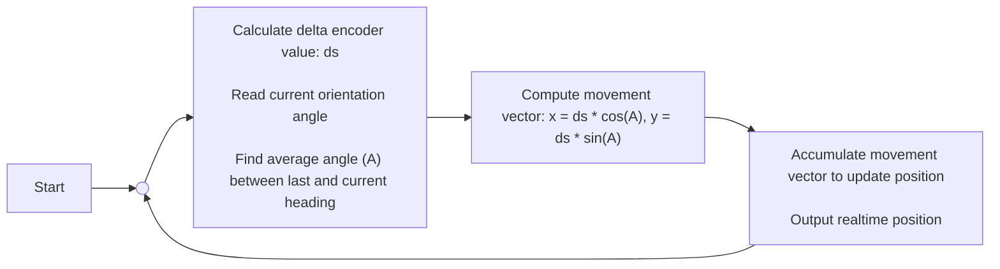
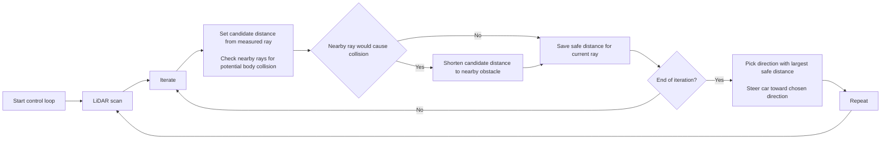
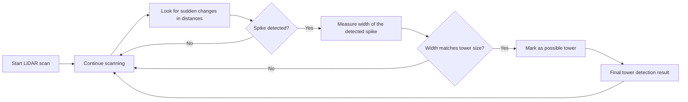
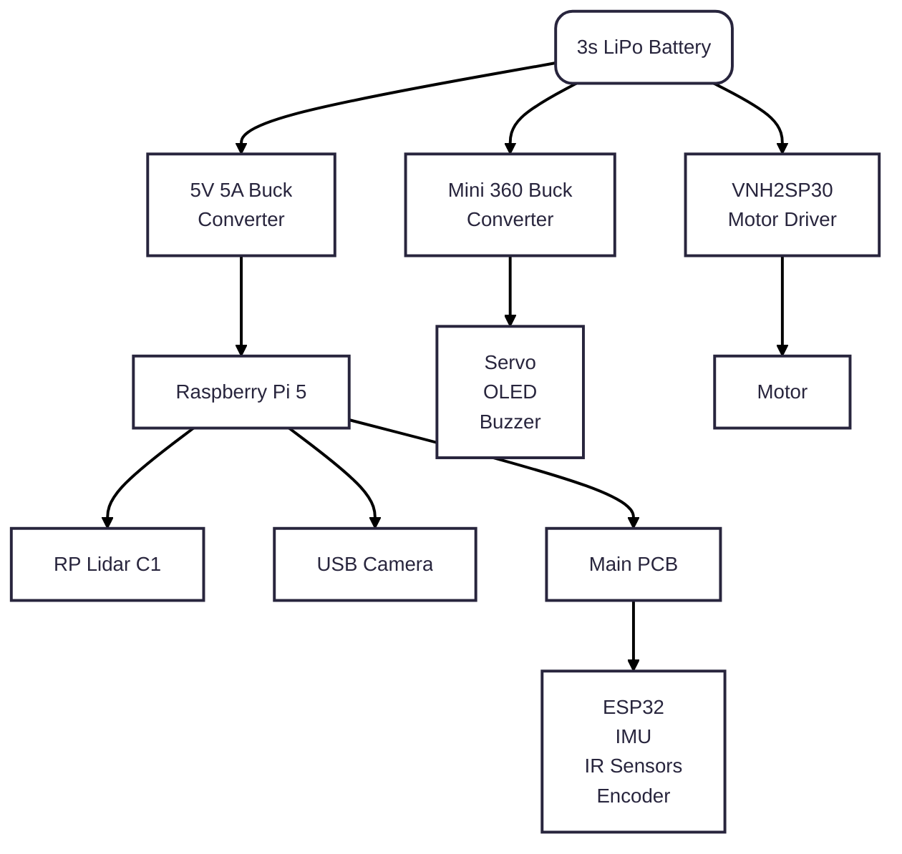

  

  <strong>Team LazyGo</strong> is a robotics team from <strong>Bangladesh</strong>. Originally formed in 2022, LazyGo won <strong>3rd palce</strong> at the Future Engineers category of the World Robot Olympiad International Round. Now the team returns again with three experienced international participants.
  

We named our robot **LazyBot**, which is built for the **Future Engineers** category in the **World Robot Olympiad 2025**. This year, we are trying to bring some interesting changes from the typical way a robot is built for this category. Definitely check out [Odometry Calculation](#odometry), [Disparity Extender Algorithm](#avoidance-using-lidar), and [LiDAR Based Tower Detection](#obstacle-round) algorithms.

This repository contains all the files, codes, models, photos and everything about our team and the robot.

Visit our team socials:

## Table of Contents

- [`Team Introduction`](#team-introduction)
- [`Mission Overview for WRO Future Engineers Rounds`](#mission-overview-for-wro-future-engineers-rounds)
- [`Repository`](#repository)
- [`Key Features`](#key-features)
- [`Components and Hardware`](#components-and-hardware)
- [`Algorithm`](#algorithm)
- [`Mobility Management`](#mobility-management)
- [`Power and Sense Management`](#power-and-sense-management)

---
## Team Introduction

   
  <strong>Iqbal Samin Prithul</strong> 
  Embedded Electronics 
  WRO 2022 International 3rd Place (Future Engineers Category) 
  <a href="mailto:prithul0218@gmail.com">prithul0218@gmail.com</a>

 

---

   
  

  <strong>A.N.M Noor</strong> 
  Software and ROS 
  WRO 2023 International Participant (Future Engineers Category) 
  <a href="mailto:noornoorrohan15@gmail.com">noornoorrohan15@gmail.com</a>

 

---

   
  <strong>Rakibul Islam</strong> 
  Hardware and CAD design 
  WRO 2024 International Participant (Future Engineers Category) 
  <a href="mailto:rakibul.rir06@gmail.com">rakibul.rir06@gmail.com</a>

 

---

---

## Mission Overview for WRO Future Engineers Rounds

<table>
  <tr>
    <td width="50%" valign="top" align="center"><h3>🏁 Round 1: Lap Completion</h3></td>
    <td width="50%" valign="top" align="center"><h3>🏆 Round 2: Lap Completion with Obstacle Avoidance and Parking</h3></td>
  </tr>
  <tr>
    <td width="50%" valign="top" align="left">
      
In <strong>Round 1</strong>, the robot must autonomously complete <strong>three laps</strong> on a pre-defined track. The goal of this round is for the bot to demonstrate stable navigation and precise lap tracking without any obstacle avoidance requirements.

      <ul>
        <li><strong>Objective</strong>: Complete three laps on the track within the allotted time.</li>
        <li><strong>Key Tasks</strong>: Accurate path-following, speed control, and lap counting.</li>
      </ul>
      

            
        
      

    </td>
    <td width="50%" valign="top" align="left">
      
In <strong>Round 2</strong>, the bot must complete <strong>three laps</strong> while avoiding green and red obstacles:

      <ul>
        <li><strong>Green Obstacles</strong>: The bot should move <strong>left</strong> to avoid.</li>
        <li><strong>Red Obstacles</strong>: The bot should move <strong>right</strong> to avoid.</li>
      </ul>
      
After completing the laps, the bot must accurately park within a designated zone.

      <ul>
        <li><strong>Objective</strong>: Complete three laps, avoid obstacles, and park in the designated area.</li>
        <li><strong>Tasks</strong>: Obstacle detection, color-based avoidance, and precision parking.</li>
      </ul>
      

        
      

    </td>
  </tr>
</table>

---
>[!IMPORTANT]
>**Important: WRO Future Engineers Rulebook**
>* **Thorough Reading:** Ensure that you thoroughly read the **WRO Future Engineers 2025 Rulebook** to understand all rules and guidelines.
>* **Official Link:** Access the rulebook here: [🔗 WRO Future Engineers 2025 Rulebook](https://wro-association.org/wp-content/uploads/WRO-2025-Future-Engineers-Self-Driving-Cars-General-Rules.pdf).

---
## Repository

This repository includes all files, designs, and code for **LazyBot**, our WRO 2025 robot.

### File Structure

Here’s a breakdown of the project folders:

- **[`assets`](./assets/)**: Contains all the images used in the README files of this repository.
- **[`instructions`](./instructions/)**: Contains all the instructions on how to setup and use the package.
- **[`models`](./models/)**: Contains 3D models and CAD designs of the robot.
- **[`src`](./src/)**: Source code for the robot's programming. This contains the ROS2 packages.
- **[`t-photos`](./t-photos/)**: Technical images of the robot build.
- **[`v-photos`](./v-photos/)**: Visual photos for aesthetics and showcasing.
- **[`video`](./video/)**: Performance and demo videos of LazyBot.

---
---

## Key Features

- **`Hybrid LEGO & 3D Printed Design`**: Using LEGO parts proved to be very helpful based on the previous experience of our members. That, along with 3D printed parts made it possible to harness LEGO's precision and the flexibility of 3D printing.
- **`Advanced Sensor Suite`**: LazyBot is equipped with a LiDAR (to perfectly sense the sorroundings), encoder motor (to precisely calculate the position), IMU (to calculate realtime orientation).
- **`Use of Robot Operating System`**: We used ROS2 to control the robot. We took this decision because Robot Operating System allows to make a project very modular and provide a lot of useful tools for simulation and visualization.
- **`Real-Time Odometry Calculation`**: This is one of the major feature of pur robot. Using the onboard IMU sensor and the value from the motor's encoder, the robot calculates the exact realtime position of the robot.
- **`Efficient Debugging`**: We've added an OLED display to the MCU of the robot which helps to debug the issues on the MCU side. And ROS2 provides with a lot of debugging tools that helps us debug any issues hapening on the Pi side.

---
---

## Components and Hardware

Our bot is equipped with various components that support its autonomous functionality. The table below summarizes each module with a concise role and assumed mounting approach (you can later refine any mounting notes):

| Component | Role / Function | Mounting | Image |
|-----------|-----------------|--------------------|-------|
| **Raspberry Pi 5** | High‑level processing (ROS2, vision, LiDAR integration). 8GB RAM for parallel tasks. | 3D printed middle chassis plate + 4× M2.5 standoffs & screws on chassis top plate. | 

 |
| **RPLidar C1** | 360° environment scan for obstacle mapping & tower shape profiling. | Top cover LiDAR mount, 4× M2.5 screws. Resting on middle layer tray for support. | 

 |
| **Logitech C270 Camera** | Color tower detection (masking & confirmation). | Mounted on 3D printed pan servo mount with single screws for angle adjustment. | 

 |
| **ESP32 Microcontroller** | Real‑time motor, encoder, IMU, servo & OLED interface; low‑level comms. | Soldered to custom secondary PCB under top cover. | 

 |
| **BNO055 9‑Axis IMU** | Orientation & fused heading for odometry; low drift angle source. | Center (slightly left) of PCB for vibration isolation; header pins +  foam tape as spacer for mild vibration dampening. | 

 |
| **1.3" OLED (I2C)** | Live status: sensor readouts, battery warnings, debug info. | Vertical raised header on PCB rear edge + friction with top cover. | 

 |
| **5V 20A Buck Converter** | Primary regulated 5V rail for Pi (headroom for peaks). | Middle chassis plate with double sided tape. | 

 |
| **5V 5A Buck (SCT2650)** | Secondary regulated supply for noise generating components (Servo, peripherals). | Bottom of PCB (to save space). | 

 |
| **25GA Gear Motors + Encoder** | Drivetrain torque + linear displacement feedback for odometry. | Captured in printed motor housings; 2× M3 screws. | 

 |
| **VNH2SP30 Motor Driver** | High‑current brushed DC control (PWM + direction + protection). | Screwed to the bottom of the second/middle layer. | 

 |
| **PS1171MG Servo** | Steering actuation & camera pan positioning. | 3D printed steering bracket/3D printed LiDAR bracket with integrated servo hole. 2× self‑tapping screws each. | 

 |
| **Custom Secondary PCB** | Integration hub: ESP32, IMU, OLED, some power distribution, headers and lots of capacitors. | Four M3 standoffs to chassis mid‑deck and top over. | 

 |
| **LEGO Differential (Gen 3)** | Allows inner/outer wheel speed difference for smooth turning. | Seated in printed cradle; retained by axle bearings (friction). | 

 |
| **3D Printed Body Frame** | Structural chassis: mounting surfaces, protective shell. 3 Layer design. | Base structure (printed as modules with minimum support); screw or snap‑fit/friction. | 

 |

> More details on the Power and sensing components can be found below.
---

## Algorithm and Software
ROS2 underpins our control system, letting us split functionality into modular nodes. Real‑time odometry (encoder + IMU) drives lap counting and parking logic. Tower detection combines LiDAR shape cues with camera color checks. Gazebo simulation allowed rapid iteration before deploying to hardware.
> **More details on software is in the [`/src`](/src/) directory.**

## Algorithm
### Odometry
A really interesting feature of our robot is that it can calculate it's realtime position. We achieved this by fusing the realtime orientation value with the motor's encoder values. When the robot is moving in a straight line, it is possible to calculate how far the robot has moven using the encoder values. But it is not so simple when the robot turns while moving. So when the robot is turning, we can actually divide it's curved path into tiny sentions that resembles a straight lines. Then accumulating those straight lines and taking their directions into account, we can find the actual cartesian displacement of the robot with reliable precision.

**Here's how it is calculated:**
1. Find the delta of the encoder's value. Let's call it `ds`
2. Find the average angle between the last calculation and current heading angle. Let's call it `A`.
3. The movement vector would be: _(x = `ds*cos(A)`, y = `ds*sin(A)`)_
4. By accumulating this movement vector, and we can find the realtime position of the robot.

Before getting an usable value, we had to calibrate our encoder to calculate values in metric unit. We did it simply by moving the robot exactly one section of the Future Engineers mat, which is conveniently 1 meter, and displaying the encoder count to help us find a "Ticks per meter" value, which is directly entered in the code.

### Open Round

#### Avoidance using LiDAR
During the open round, there is no towers on the track. So we don't need the camera. To move the robot in the track, we use a modified version of `Disparity Extender` algorithm. Here's a step by step description of the idea:

1. The LiDAR scans the area and gives a bunch of distances in many directions (one distance per ray).
1. For each ray, start with the ray’s measured distance as the “candidate” distance.
1. Look at the nearby rays around that ray. If any nearby ray’s obstacle is close enough that the car’s body would hit it when moving along the candidate ray, shorten the candidate distance to that nearby obstacle. (In other words: pretend the car is wide and see where it would first hit something.)
1. After doing that for every ray, you have a “safe distance” for every direction — the farthest you can travel in that direction without your body hitting something.
1. Pick the direction with the largest safe distance and steer the car toward it.

One drawback of this method is that on straight sections, the robot shows a tendency to point itself toward the next corner. This happens because corners often look like the direction with the most open space before discovering the next turn, so the algorithm treats them as the safest option - even though the robot should ideally stay centered on the straight path. But this algorithm works really well to move between tight gaps. So the little drawback doesn't really matter to us. And ofcourse, there are ways to improve on this issue.

One important thing to remember is that the robot does not target the farthest distance. Instead, it targets the farthest `safe` distance - where it can move to without collision. Here's a graphic demonstration to help you understand how it works:

<table>
    <tr>
        <td align="center">
            
        </td>
        <td align="center">
            
        </td>
    </tr>
    <tr>
        <td align="center">Targetting farthest distance</td>
        <td align="center">Targetting farthest `safe` distance</td>
    </tr>
</table>

#### Lap Count
Because we can precisely calculate odometry, keeping lap count is a simple task. The robot just keeps track of how many times it passes through the starting section. When it reaches the desired lap count, it just stops there. It worked amazingly well right off the bat. In our test, robot always stopped between a few centimeters from the dead center of where it started in a test without parking. 

### Obstacle Round
It works similar to the open round. But the robots needs to detect the towers. In our robot, tower detection is done in two ways.

1. `Using the camera`: This is a very basic color detection algorithm. From the camera feed, the robot detects the towers by masking colors.
1. `Using LiDAR data`: This approach is a bit more interesting. Towers create sudden changes (valley) in the LiDAR distance readings. If the readings suddenly get closer and then farther again, that usually means there’s an object in between. By checking how wide this change looks from the LiDAR’s point of view, we can estimate whether it matches the expected size of a tower. The object's size can be easily calculated using the formula `s = rθ`. If the size is around 5cm (width of a tower) the robot marks it as a possible tower. But it still confirms the color with the camera to be sure.

Here's how it works:

<table>
    <tr>
        <td align="center">
            
        </td>
        <td align="center">
            
        </td>
    </tr>
    <tr>
        <td align="center">The valley has a depth of more than 20cm and the calculated size is around 5cm</td>
        <td align="center">These are not towers because either the valley depth is lower than 20cm, or the calculated size is much different from 5cm.</td>
    </tr>
</table>

After detecting the towers, the robot needs to avoid them. The robot needs to move to the left of green objects. So what it does, it imagins a wall at the right of any green tower. That way,the robot is forced to pass the object from the left side. The opposite happens for red towers.
> Our codes are commented for ease of understanding on how the algorithm works

### Imporntant Note on the Camera

We attached the robot's main camera on a servo motor. Since we are detecting the towers' positions using the LiDAR values, we can easily point the camera towards the closest object using the servo. This makes it super easy to isolate a target tower. And allows us to use a lower Field of View (`FoV`) camera and cover a large area.

#### But does using a low `FoV` camera have any benefits?

Fish eye lenses, with high `FoV`s introduce a lot of distortion. It can be fixed by calculating the lense intrinsics and camera matrix coefficients, but that also takes up some processing time as it needs to be done for every frame. It is not too big of an issue if you just need to use color masking using OpenCV. However, there is another issue with high `FoV` cameras.   
Generally, cameras with a higher `FoV` have lower image brightness (per unit area) if other settings (such as aperture and exposure time) remain the same. This is because the same amount of light gathered by the lens is distributed over a larger sensor area.   
We can increase the exposure, but that increases motion blur and sometimes even introduces lag. This is an issue especially for the WRO Future Engineers Category. Over the years, we've noticed that the tower colors are usually very dark. This makes it tricky to detect their colors, and differentiate them from the black wall. Here, a camera with more overall brightness will perform better than one with a lower overall brightness. So a low `FoV` camera helps in this sense as well. 

In addition, as we are directly pointing the camera towards a tower, putting the color detection object in the center of the camera field of view, reducing the risk of detecting the wrong color.

> **TL;DR:** Higher `FoV` cameras distribute light over a higher area, reducing overall picture brightness. The LazyBot uses lower `FoV` camera points it at target objects to tackle low light conditions.

## **Mobility Management**

This segment outlines the mobility system of **LazyBot**, with two key features: a differential gear system, and ackermann steering. But first, a little bit about our chassis design and motors:
### The Chassis Design
The LazyBot chassis was designed completely from scratch on OnShape 3D for online collaboration and ease of use on lower end computers. The robot has 3 separate layers, which are held together using M3 metal standoffs.
1. **First/Bottom layer:** 
     - 5mm above ground.
     - 3mm thick 3D-printed sheet with mounting holes.
     - Holds steering mechanism + servo motor, LiPo Battery, main differential drive +25GA motor.
2. **Second/Middle Layer:**
   - 36mm above the bottom layer.
   - 3mm thick 3D-printed sheet with mounting holes.
   - Holds Raspberry Pi 5, 5V 20A buck converter, VNH2SP30 motor driver.
   - Supports LiDAR from the bottom.
3. **PCB and top cover:**
   - 30mm above the second layer.
   - Acts as the third layer, with a light 3D printed top cover 15mm offset from the top of the PCB.
   - The top cover also mounts the LiDAR and camera pan servo.

#### **Step-by-step assembly:**
Assembly of the robot is simple as it is built from the bottom up. The first layer can be assembled first with al the components it holds and the wheels installed. Adding the standoff to the bottom layer - we can continue to the second layer, which should be partly pre-asssembled with the motor driver at the bottom and the buck converter + Raspberry Pi 5 mounted at the top. At this point, partial wiring can be done between the first and second layer. Then, the PCB  is assenbled at the top with 30mm standoffs. Upon connecting all the cables to the PCBs using JST connectors, the top cover is mounted with preinstalled LiDAR. The camera pan servo should be pre-inserted into the top cover with its dedicated wire routing slow. Then, everything can be closed off with appropriate wiring through the wiring holes/slots. We recommend checking out our complete 3D model if you get stuck at any step:)
## **Mobility Management**

This segment outlines the mobility system of **LazyBot**, with two key features: a differential gear system, and ackermann steering. But first, a little bit about our chassis design and motors:

### The 25GA370 Motor

We initially wanted to use a 20GA motor for the best balance between torque, speed, and size from our experience. However, after our first 20GA sized motor from China refused to stop working, we had to resort to the more commonly and locally available 25GA motor. 

### The Chassis Design
The LazyBot chassis was designed completely from scratch on OnShape 3D for online collaboration and ease of use on lower end computers. The robot has 3 separate layers, which are held together using M3 metal standoffs.
1. **First/Bottom layer:** 
     - 5mm above ground.
     - 3mm thick 3D-printed sheet with mounting holes.
     - Holds steering mechanism + servo motor, LiPo Battery, main differential drive +25GA motor.
2. **Second/Middle Layer:**
   - 36mm above the bottom layer.
   - 3mm thick 3D-printed sheet with mounting holes.
   - Holds Raspberry Pi 5, 5V 20A buck converter, VNH2SP30 motor driver.
   - Supports LiDAR from the bottom.
3. **PCB and top cover:**
   - 30mm above the second layer.
   - Acts as the third layer, with a light 3D printed top cover 15mm offset from the top of the PCB.
   - The top cover also mounts the LiDAR and camera pan servo.

#### **Step-by-step assembly:**
Assembly of the robot is simple as it is built from the bottom up. The first layer can be assembled first with al the components it holds and the wheels installed. Adding the standoff to the bottom layer - we can continue to the second layer, which should be partly pre-asssembled with the motor driver at the bottom and the buck converter + Raspberry Pi 5 mounted at the top. At this point, partial wiring can be done between the first and second layer. Then, the PCB  is assenbled at the top with 30mm standoffs. Upon connecting all the cables to the PCBs using JST connectors, the top cover is mounted with preinstalled LiDAR. The camera pan servo should be pre-inserted into the top cover with its dedicated wire routing slow. Then, everything can be closed off with appropriate wiring through the wiring holes/slots. We recommend checking out our complete 3D model if you get stuck at any step:)

### The 25GA370 Motor

We initially wanted to use a 20GA motor for the best balance between torque, speed, and size from our experience. However, after our first 20GA sized motor from China refused to stop working, we had to resort to the more commonly and locally available 25GA motor. 

The motor provides sufficient torque at slow speeds with decent maximum speeds. The encoder, with it's roughly 1870 ticks per meter precision, does a great job at measuring robot precision at millimeter level accuracy.

### Servo Selection:
Since we are using two servos in our system, we decided to use the same servo for both mechanism to allow for less individual part count. The PS-1171mg was an excellent choice, available in the Bangladeshi local market. Its metal gears give us peace of mind, and 0.17s/deg movement speed was adequate for our robot.

### Differential Drive System

Our robot utilizes a **3rd generation LEGO differential gearbox**. Differential drive is a crucial feature for smooth cornering and precise movements. The Lego Gearbox is small with low backlash, something we were not able to achieve with gears printed on our 3D printer.

<table>
<tr>
<td width="50%">

#### How It Works:
- The motor is connected to the differential gearset using.a matching 20 teeth 3D printed gear. The gear system transfers torque from the motor to the gearbox with a **1:1.2** ratio.
- The differential automatically compensates for wheel speed differences when turning.
- Encoder readings stay accurate as it records roughly the average speed of the two wheels.

> Needs work here. How many teeth does the LEGO differential have? Research about encoder power getting divided.

#### Benefits of our drive train:
1. **Smooth Turning**: Independent wheel speeds allow efficient navigation.
2. **Precise Odometry**: Encoders enhance path planning and tracking.
3. **Compact & Modular**: LEGO-based integration makes the drivetrain easy to modify and assemble.
4. **Freedom to change gear ratio**: 3D printing one gear allowed us to change the gear ratio, as our motor was just a tad bit too fast.

  

</td>
<td width="50%">

  
   
  A 16GA Motor was being used when we took this picture.

</td>
</tr>
</table>

### **Steering System - 3D Printed Ackermann Mechanism**

The robot features a **3D printed Ackermann steering system** controlled by a **servo motor**. This configuration allows the front wheels to turn at appropriate angles during a corner, minimizing tire slippage and improving steering accuracy.

##### Advantages:
1. **Sharper turns**: While not imporant in such small scale, the mechanical efficiency that comes with the Ackermann design allows sharper turns.
2. **Customizable Design**: 3D printed components allowed fine-tuning and easy iteration.
3. **Precise Control**: Servo-driven mechanism ensures consistent and accurate angle adjustments.
4. **Adjustable links**: We used off-the-shelf RC car links to 

> Add a photo of ackermann system and how it works

  

---
---

## Power and Sense Management

Our robot has been designed to optimize performance while ensuring reliable power delivery, precise sensing, and efficient communication between components.

It is is powered by a 3-cell lithium battery. Two dedicated buck converters for high and low noise devices. This structure ensures stable operation across core modules like the Raspberry Pi 5, RPLidar, ESP32, sensors, and motor systems. The decision to use separate buck converters was made when we found out that the servo motors can take a significant amount of in-rush current, which was causing our Raspberry Pi to throttle, and ESP32 to go into brownout detection causing a reset.

Below is the complete schematic of the PCB. External to the PCB, we have the 5V 20A buck converter, and a DC motor driver.

---

  

> Add a photo of the PCB wirig

### Here is a detailed explanation of the power and sense components:

#### **1. Power Source: 3-Cell Lithium Polymer Battery**
- **Configuration**: 3S (3 cells in series)
- **Voltage**: 12.6V (fully charged) → ~11.1V (nominal) → ~9.9V (discharged)
- **Benefits**:
  - High energy density
  - Sufficient current delivery for high-load components like Motors, Pi and LiDAR
  - Rechargeable and easily sourceable

---

#### **2. Main 5V 20A Buck Converter (Unknown chip)**
- **Purpose**: Supplies 5.1V to **Raspberry Pi 5, RPLidar C1, and ESP32**
- **Input**: Directly from the 3S battery (~12.6V max)
- **Output**: Stable 5.1V 
- **Benefits**:
  - Ensures separate 5V with separate ground path so that the servo current does not affect other modules. 
  - Enhances RPLidar C1 and Encoder precision with reduced noise.

---

#### **3. Secondary 5V 5A Buck Converter (SCT2650)**
- **Purpose**: Supplies 5V to **Servo, OLED, Buzzer**
- **Input**: Directly from the 3S battery (~12.6V max)
- **Output**: Rush currents at 5V / 5A
- **Benefits and reason to choose**:
  - The SCT2650 is a near-identical copy of the Texas Instruments TPS54560 chip, efficient design.
  - Chosen for it's excellent noise free design with multiple capacitors in series, and high current schottkey diode.
  - There is no overrcurrent protection false-triggering when the servos draw sudden in-rush current. This is an issue we had befoer with the Mini 560 Buck converter.

---

#### **4. VNH2SP30 Motor Driver with Built-in Regulator**
- **Purpose**: Drives the **25GA motor**
- **Regulation**: Built-in buck handles motor voltage directly from the 3S battery
- **Features**:
  - No external 5V needed
  - Simplifies wiring and improves efficiency
  - Has very low RDS(on) resistance with integrated protections
  - Something we had easy access to in the market :)

---

### Voltage Distribution Table

| Component                     | Voltage Supplied | Power Source / Converter        |
|-------------------------------|------------------|----------------------------------|
| **Raspberry Pi 5**            | 5.1V*               | Unknown chip 5A Buck             |
| **RPLidar C1**                | 5.1V*              | Unknown chip 5A Buck             |
| **ESP32 + Sensors**    | 5.1V*               | Unknown chip 5A Buck             |
| **Servo Motor + OLED**               | 5V               | SCT2650 5A Buck                  |
| **Motors (20GA with encoder)**| Battery Voltage  | VNH2SP30 Motor Driver (built-in) |

> ***The 5V 20A buck converter module has a 2.8V-5.6V adjustable potentiometer, which allows us to conveniently set the voltage to 5.1V. This helps avoid throttling on the pi caused by voltage drop on the wire and PCB.**
#### Flowchart for ease of understanding:

---
---

## Custom Homemade PCB
Since SMD PCB manufacturing is not available to public in Bangladesh, and services like JLCPCB are extremely expensive due to unfair customs taxes, we had to design our own through hole PCB and manufacture it right at home.

The PCB is designed to use locally available components, with a lot of board clearance to allow us to etch the PCB using ferric chloride. The process included:
1. Printing a mirrrored black and white version of the copper traces on a glossy paper.
2. Transferring the ink onto the PCB using an iron on the PCB with the glossy paper sandwiched in between.
3. Fixing minor transfer errors with a permanent black marker.
4. Etching the PCB in a ferric chloride solutions for a fixed amount of time (gained through experience).
5. Cleaning up the board with isopropyl alcohol and mildly sanding the copper to clear oxidization.
6. Applying a thin layer of resin to coat the copper traces.

### PCB Views

| **Top View of the PCB**                 | **Bottom View of the PCB**             |
|-------------------------------------|-------------------------------------|
|  |  |

