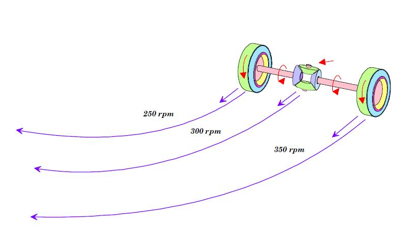
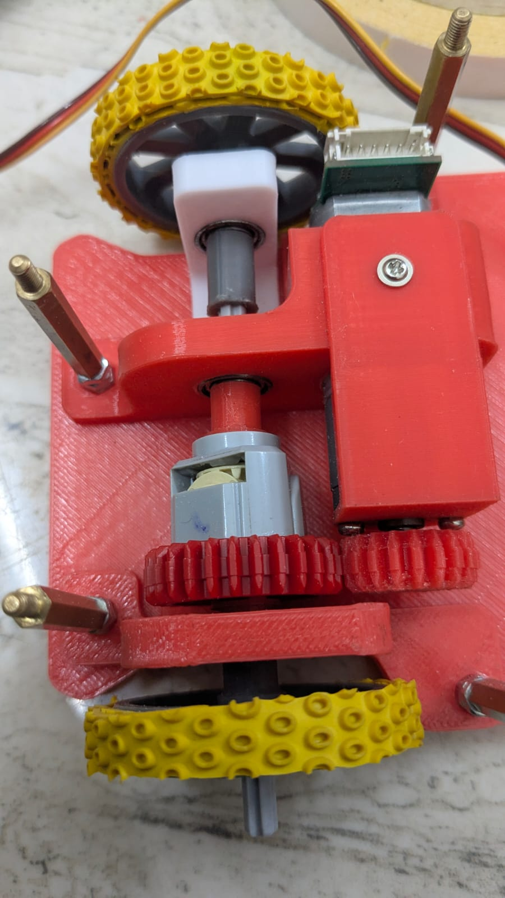
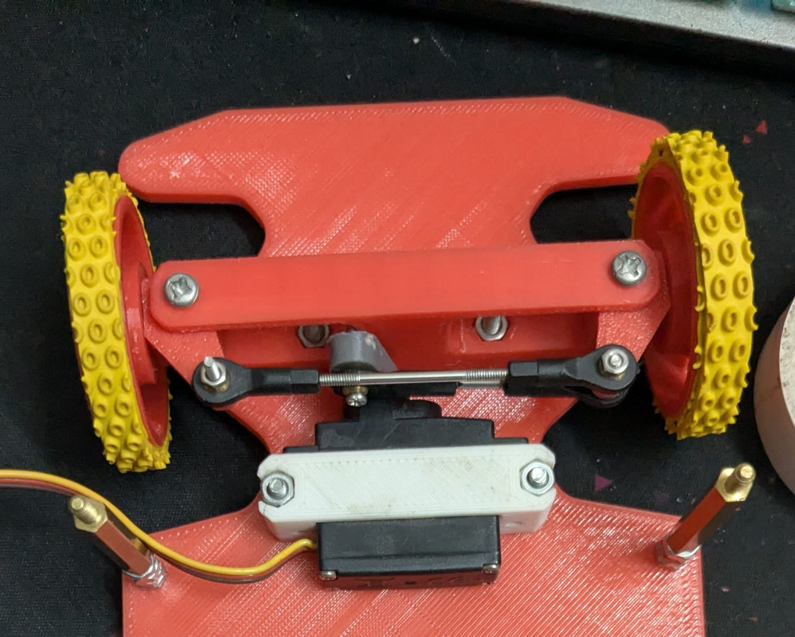
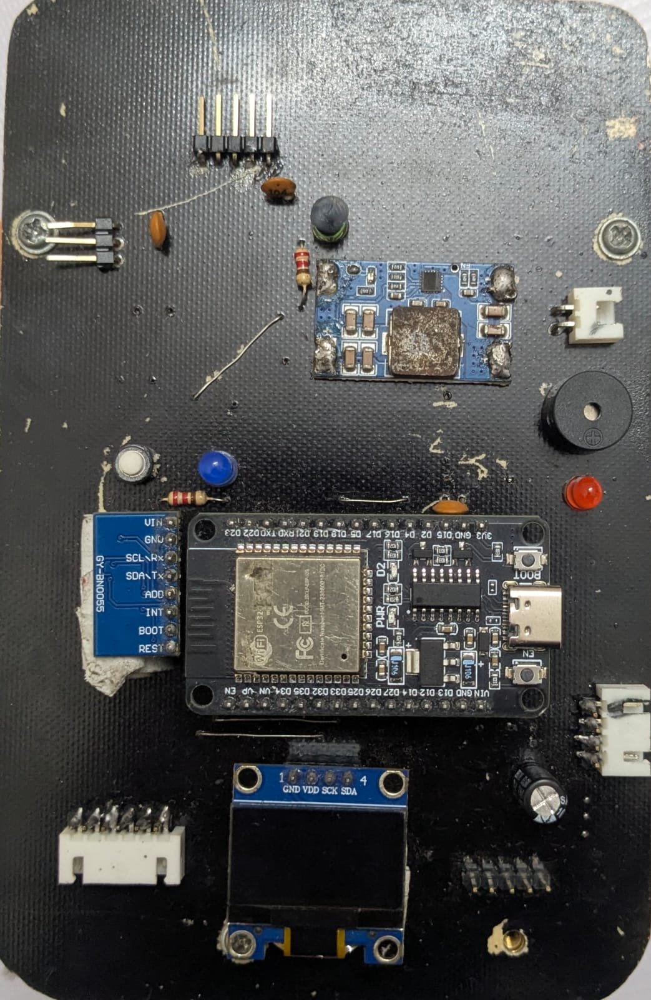
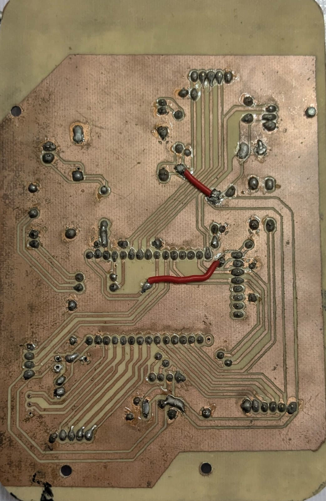

  

  <strong>Team LazyGo</strong> is a robotics team from <strong>Bangladesh</strong>. Originally formed in 2022, LazyGo won <strong>Bronze</strong> at the WRO international round in the Future Engineers category. Now returns again with three experienced international participants.
  

We named our robot **LazyBot**, which is built for the **Future Engineers** category in the **World Robot Olympiad 2025**. This year, we are trying to bring some interesting changes from the typical way a robot is built for this category. This repository contains all the files, codes, models, photos and everything about our team and the robot.

Visit our socials:

## Table of Contents

- [`Team Introduction`](#team-introduction)
- [`Mission Overview for WRO Future Engineers Rounds`](#mission-overview-for-wro-future-engineers-rounds)
- [`Repository`](#repository)
- [`Key Features`](#key-features)
- [`Components and Hardware`](#components-and-hardware)
- [`Algorithm`](#algorithm)
- [`Mobility Management`](#mobility-management)
- [`Power and Sense Management`](#power-and-sense-management)

---
## Team Introduction

   
  <strong>Iqbal Samin Prithul</strong> 
  Embedded Electronics 
  WRO 2022 International Bronze Medalist (Future Engineers Category) 
  <a href="mailto:prithul0218@gmail.com">prithul0218@gmail.com</a>

 

---

   
  

  <strong>A.N.M Noor</strong> 
  Software and ROS 
  WRO 2023 International Participant (Future Engineers Category) 
  <a href="mailto:noornoorrohan15@gmail.com">noornoorrohan15@gmail.com</a>

 

---

   
  <strong>Rakibul Islam</strong> 
  Hardware and CAD design 
  WRO 2024 International Participant (Future Engineers Category) 
  <a href="mailto:rakibul.rir06@gmail.com">rakibul.rir06@gmail.com</a>

 

---

---

## Mission Overview for WRO Future Engineers Rounds

<table>
  <tr>
    <td width="50%" valign="top" align="center"><h3>🏁 Round 1: Lap Completion</h3></td>
    <td width="50%" valign="top" align="center"><h3>🏆 Round 2: Lap Completion with Obstacle Avoidance and Parking</h3></td>
  </tr>
  <tr>
    <td width="50%" valign="top" align="left">
      
In <strong>Round 1</strong>, the robot must autonomously complete <strong>three laps</strong> on a pre-defined track. The goal of this round is for the bot to demonstrate stable navigation and precise lap tracking without any obstacle avoidance requirements.

      <ul>
        <li><strong>Objective</strong>: Complete three laps on the track within the allotted time.</li>
        <li><strong>Key Tasks</strong>: Accurate path-following, speed control, and lap counting.</li>
      </ul>
      

            
        
      

    </td>
    <td width="50%" valign="top" align="left">
      
In <strong>Round 2</strong>, the bot must complete <strong>three laps</strong> while avoiding green and red obstacles:

      <ul>
        <li><strong>Green Obstacles</strong>: The bot should move <strong>left</strong> to avoid.</li>
        <li><strong>Red Obstacles</strong>: The bot should move <strong>right</strong> to avoid.</li>
      </ul>
      
After completing the laps, the bot must accurately park within a designated zone.

      <ul>
        <li><strong>Objective</strong>: Complete three laps, avoid obstacles, and park in the designated area.</li>
        <li><strong>Tasks</strong>: Obstacle detection, color-based avoidance, and precision parking.</li>
      </ul>
      

        
      

    </td>
  </tr>
</table>

---
>[!IMPORTANT]
>**Important: WRO Future Engineers Rulebook**
>* **Thorough Reading:** Ensure that you thoroughly read the **WRO Future Engineers 2025 Rulebook** to understand all rules and guidelines.
>* **Official Link:** Access the rulebook here: [🔗 WRO Future Engineers 2025 Rulebook](https://wro-association.org/wp-content/uploads/WRO-2025-Future-Engineers-Self-Driving-Cars-General-Rules.pdf).

---
## Repository

This repository includes all files, designs, and code for **LazyBot**, our WRO 2025 robot. Below is the file structure:

### File Structure

Here’s a breakdown of the project folders:

- **[`assets`](./assets/)**: Contains all the images used in the README files of this repository.
- **[`instructions`](./instructions/)**: Contains all the instructions on how to setup and use the package.
- **[`models`](./models/)**: Contains 3D models and CAD designs of the robot.
- **[`src`](./src/)**: Source code for the robot's programming. This contains the ROS2 packages.
- **[`t-photos`](./t-photos/)**: Technical images of the robot build.
- **[`v-photos`](./v-photos/)**: Visual photos for aesthetics and showcasing.
- **[`video`](./video/)**: Performance and demo videos of LazyBot.

---
---

## Key Features

- **`Hybrid LEGO & 3D Printed Design`**: Using LEGO parts proved to be very helpful based on the previous experience of our members. That, along with 3D printed parts made it possible to harness LEGO's precision and the flexibility of 3D printing.
- **`Advanced Sensor Suite`**: LazyBot is equipped with a LiDAR (to perfectly sense the sorroundings), encoder motor (to precisely calculate the position), IMU (to calculate realtime orientation).
- **`Use of Robot Operating System`**: We used ROS2 to control the robot. We took this decision because Robot Operating System allows to make a project very modular and provide a lot of useful tools for simulation and visualization.
- **`Real-Time Odometry Calculation`**: This is one of the major feature of pur robot. Using the onboard IMU sensor and the value from the motor's encoder, the robot calculates the exact realtime position of the robot.
- **`Efficient Debugging`**: We've added an OLED display to the MCU of the robot which helps to debug the issues on the MCU side. And ROS2 provides with a lot of debugging tools that helps us debug any issues hapening on the Pi side.

---
---

## Components and Hardware

Our bot is equipped with various components that support its autonomous functionality. Below is a breakdown of the key hardware elements used in this project:

| Component                          | Description                                                                                      | Image                                                                                      | Purchase Link                                                                                     |
|-----------------------------------|--------------------------------------------------------------------------------------------------|--------------------------------------------------------------------------------------------|---------------------------------------------------------------------------------------------------|
| **Raspberry Pi 5**                | Provides powerful onboard processing for computer vision, and higher-level navigation.     | 

                  | [Purchase Raspberry Pi 5](#)                                                                      |
| **RPLidar C1**                    | Enables 360-degree obstacle detection and environment mapping through LiDAR scanning.            | 

                       | [Purchase RPLidar C1](#)                                                                          |
| **ESP32 Microcontroller**         | Manages real-time control such as motor commands, sensor data collection, and communication.     | 

                            | [Purchase ESP32](#)                                                                               |
| **BNO055 9Axis IMU Sensor** | Tracks orientation and motion to assist with balance and movement stabilization. The internal microcontroller allows for precision orientation tracking.                 | 

                          | [Purchase BNO055](#)                                                                             |
| **0.96" OLED Display (I2C)**      | Displays status information such as sensor readings, and debug info.                    | 

                     | [Purchase OLED Display](#)                                                                        |
| **Mini560 Buck Converter**        | Provides compact 5V power regulation for the Raspberry Pi and peripherals.                        | 

           | [Purchase Mini560 Buck Converter](#)                                                              |
| **LM2596 5V 5A Buck Converter**   | Supplies a steady 5V 5A output for powering high-draw components like the motor driver.           | 

            | [Purchase LM2596 Buck Converter](#)                                                               |
| **25GA Gear Motors with Encoder** | Offers precise speed and position feedback for accurate wheel control and localization.          | 

          | [Purchase 25GA Encoder Motor](#)                                                                  |
| **VNH2SP30 Motor Driver**         | High-power motor driver used to control brushed DC motors with PWM and direction control.        | 

            | [Purchase VNH2SP30](#)                                                                            |
| **AM117 Servo Motor**             | Controls precise angular movements, typically used for steering or actuation.                    | 

                      | [Purchase AM117 Servo](#)                                                                         |
| **Custom Secondary PCB**          | Integrates ESP32, BNO055, OLED, and buck converter for cleaner wiring and modularity.           | 

                       | N/A                                                                                               |
| **3rd Generation LEGO Differential** | Utilized in the drive system to enable turning with gear synchronization.                        | 

                | [Purchase LEGO Differential](#)                                                                   |
| **3D Printed Body Frame**         | Provides a lightweight and modular chassis tailored for our component layout and design.         | 

                 | N/A                                                                                               |

---
---

## Algorithm
### Odometry
A very interesting feature of our robot is that it can calculate it's realtime position. We achieved this by fusing the realtime orientation value with the motor's encoder values. When the robot is moving in a straight line, it is possible to calculate how far the robot has moven using the encoder values. But it isn't sosimple when the robot turns. But when the robot is turning, we can actually divide it's curved path into tiny sentions that resembles straight lines. And if we accumulate those straight lines, taking their directions into account, we can find the actual displacement of the robot pretty accurately.

Here's how it is calculated:
1. Find the delta of the encoder's value. Let's call it `ds`
1. Find the average angle between the last calculation and current heading angle. Let's call it `A`.
1. The movement vector would be: _(x = `ds*cos(A)`, y = `ds*sin(A)`)_
1. By accumulating this movement vector, and we can find the realtime position of the robot.

Before getting an usable value, we had to calibrate our encoder to calculate values in metric unit.

### Open Round

#### Avoidance using LiDAR
During the open round, there is no towers on the track. So we don't need the camera. To move the robot in the track, we use a modified version of [Disparity Extender](https://www.nathanotterness.com/2019/04/the-disparity-extender-algorithm-and.html) algorithm. Here's a step by step description of the idea:

1. The LiDAR scans the area and gives a bunch of distances in many directions (one distance per ray).
1. For each ray, start with the ray’s measured distance as the “candidate” distance.
1. Look at the nearby rays around that ray. If any nearby ray’s obstacle is close enough that the car’s body would hit it when moving along the candidate ray, shorten the candidate distance to that nearby obstacle. (In other words: pretend the car is wide and see where it would first hit something.)
1. After doing that for every ray, you have a “safe distance” for every direction — the farthest you can travel in that direction without your body hitting something.
1. Pick the direction with the largest safe distance and steer the car toward it.

One drawback of this method is that on straight sections, the robot shows a tendency to point itself toward the next corner. This happens because corners often look like the direction with the most open space before discovering the next turn, so the algorithm treats them as the safest option - even though the robot should ideally stay centered on the straight path. But this algorithm works really well to move between tight gaps. So the little drawback doesn't really matter to us. And ofcourse, there are ways to improve on this issue.
#### Lap Count
Because we can precisely calculate odometry, keeping lap count is a very simple task. The robot just keeps track of how many times it passes through the starting section. When it reaches the desired lap count, it just stops there. And it worked really well. The robot always stops between a few centimeters from the dead center of the starting section.

### Camera Placement

The robot's main camera is positioned at the front and angled directly forwards. The camera is place 5cm above ground level so it is directly pointing towards the center of the towers. The camera feeds data to the **Raspberry Pi 5**, which processes the image to detect the towers. The processed dataalong with the LiDAR scan is used to plan the movement of the robot. The Pi then sends throttle and steering value to the ESP32. The ESP32 controls the motor and servo to move the robot.

---
---

## Mobility Management

This segment outlines the mobility system of **LazyBot**, with two key features: a differential gear system, and ackermann steering.

---

### **Differential Drive System**

Our robot utilizes a differential gear system powered by one **20GA DC gear motor with encoders** and a **3rd generation LEGO differential**, allowing the wheels on the same axle to rotate at different speeds even though they are both connected toa single motor. This is crucial feature for smooth cornering and precise movement.

<table>
<tr>
<td width="50%">

#### How It Works:
- The motor is connected to the differential gearset. The gear system distributes torque to the wheels as needed.
- The differential automatically compensates for wheel speed differences when turning.
- Encoders provide real-time feedback to ensure accurate speed and distance tracking.

#### Benefits:
1. **Smooth Turning**: Independent wheel speeds allow efficient navigation.
2. **Precise Odometry**: Encoders enhance path planning and tracking.
3. **Compact & Modular**: LEGO-based integration makes the drivetrain easy to modify or maintain.

  

</td>
<td width="50%">

  

</td>
</tr>
</table>

### **Steering System - 3D Printed Ackermann Mechanism**

The robot features a **3D printed Ackermann steering system** controlled by a **servo motor**. This configuration allows the front wheels to turn at appropriate angles during a corner, minimizing tire slippage and improving real-world steering accuracy.

##### Advantages:
1. **Realistic Geometry**: Replicates automotive-grade steering for smoother and more stable turns.
2. **Customizable Design**: 3D printed components allow fine-tuning and easy iteration.
3. **Precise Control**: Servo-driven mechanism ensures consistent and accurate angle adjustments.
4. **Mechanical Efficiency**: Reduces energy loss and component wear during turning.

  

---

### **Motor Driver - VNH2SP30**

To control the high-current 20GA motor, we use the **VNH2SP30 full-bridge motor driver**. It allows for bidirectional motor control and supports high current output with excellent thermal performance.

##### Features:
- **High Power Handling**: Supports up to 30A peak, suitable for robust DC motor.
- **PWM Support**: Allows smooth speed control using ESP32 PWM signals.
- **Thermal Shutdown & Protection**: Keeps the system safe during heavy load.

---
---

## Power and Sense Management

The **Power and Sense Management** system of our robot has been meticulously designed to optimize performance while ensuring reliable power delivery, precise sensing, and efficient communication between components.

---

### Overview

Our system is powered by a 3-cell lithium battery and efficiently distributed using dedicated buck converters for high and low power domains. This structure ensures stable operation across core modules like the Raspberry Pi 5, RPLidar, ESP32, sensors, and motor systems.

---

### System Architecture

#### **1. Power Source: 3-Cell Lithium Polymer Battery**
- **Configuration**: 3S (3 cells in series)
- **Voltage**: 12.6V (fully charged) → ~11.1V (nominal) → ~9V (discharged)
- **Features**:
  - High energy density
  - Sufficient current delivery for high-load components like Pi and LiDAR
  - Rechargeable and lightweight

---

#### **2. LM2596 / Mini560 5A Buck Converter**
- **Purpose**: Supplies 5V to **Raspberry Pi 5** and **RPLidar C1**
- **Input**: Directly from the 3S battery (~12.6V max)
- **Output**: Stable 5V / 5A
- **Benefits**:
  - Powers high-demand modules without overheating
  - Ensures stable real-time data processing and mapping

---

#### **3. Secondary 5V Buck Converter**
- **Purpose**: Powers the **ESP32**, **MPU6050**, **OLED display**, and other secondary PCB components
- **Input**: 12.6V battery input
- **Output**: 5V regulated
- **Use Cases**:
  - Enables low-power real-time control and sensing
  - Protects ESP32 and peripherals from voltage fluctuations

---

#### **4. VNH2SP30 Motor Driver with Built-in Regulator**
- **Purpose**: Drives the **20GA motor with encoders**
- **Regulation**: Built-in buck handles motor voltage directly from the 3S battery
- **Features**:
  - No external buck needed
  - Simplifies wiring and improves efficiency
  - Supports high current with integrated protections

---

### Voltage Distribution Table

| Component                     | Voltage Supplied | Power Source / Converter        |
|-------------------------------|------------------|----------------------------------|
| **Raspberry Pi 5**            | 5V               | LM2596 / Mini560 (5A Buck)       |
| **RPLidar C1**                | 5V               | LM2596 / Mini560 (5A Buck)       |
| **ESP32 + Sensors + OLED**    | 5V               | Secondary Buck Converter         |
| **Motors (20GA with encoder)**| Battery Voltage  | VNH2SP30 Motor Driver (built-in) |

---
---

## Our PCB is custom made. 

### PCB Views

| **Top View of PCB**                 | **Bottom View of PCB**             |
|-------------------------------------|-------------------------------------|
|  |  |

