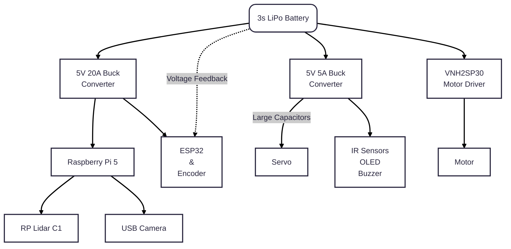

  

  <strong>Team LazyGo</strong> is a robotics team from <strong>Bangladesh</strong>. Originally formed in 2022, LazyGo won <strong>Bronze</strong> at the WRO international round in the Future Engineers category. Now returns again with three experienced international participants.
  

We named our robot **LazyBot**, which is built for the **Future Engineers** category in the **World Robot Olympiad 2025**. This year, we are trying to bring some interesting changes from the typical way a robot is built for this category. Definitely check out [Odometry Calculation](#odometry), [Disparity Extender Algorithm](#avoidance-using-lidar), and [LiDAR Based Tower Detection](#obstacle-round) algorithms.

This repository contains all the files, codes, models, photos and everything about our team and the robot.

Visit our socials:

## Table of Contents

- [`Team Introduction`](#team-introduction)
- [`Mission Overview for WRO Future Engineers Rounds`](#mission-overview-for-wro-future-engineers-rounds)
- [`Repository`](#repository)
- [`Key Features`](#key-features)
- [`Components and Hardware`](#components-and-hardware)
- [`Software`](#software)
- [`Mobility Management`](#mobility-management)
- [`Power and Sense Management`](#power-and-sense-management)

---
## Team Introduction

   
  <strong>Iqbal Samin Prithul</strong> 
  Embedded Electronics 
  WRO 2022 International Bronze Medalist (Future Engineers Category) 
  <a href="mailto:prithul0218@gmail.com">prithul0218@gmail.com</a>

 

---

   
  

  <strong>A.N.M Noor</strong> 
  Software and ROS 
  WRO 2023 International Participant (Future Engineers Category) 
  <a href="mailto:noornoorrohan15@gmail.com">noornoorrohan15@gmail.com</a>

 

---

   
  <strong>Rakibul Islam</strong> 
  Hardware and CAD design 
  WRO 2024 International Participant (Future Engineers Category) 
  <a href="mailto:rakibul.rir06@gmail.com">rakibul.rir06@gmail.com</a>

 

---

---

## Mission Overview for WRO Future Engineers Rounds

<table>
  <tr>
    <td width="50%" valign="top" align="center"><h3>🏁 Round 1: Lap Completion</h3></td>
    <td width="50%" valign="top" align="center"><h3>🏆 Round 2: Lap Completion with Obstacle Avoidance and Parking</h3></td>
  </tr>
  <tr>
    <td width="50%" valign="top" align="left">
      
In <strong>Round 1</strong>, the robot must autonomously complete <strong>three laps</strong> on a pre-defined track. The goal of this round is for the bot to demonstrate stable navigation and precise lap tracking without any obstacle avoidance requirements.

      <ul>
        <li><strong>Objective</strong>: Complete three laps on the track within the allotted time.</li>
        <li><strong>Key Tasks</strong>: Accurate path-following, speed control, and lap counting.</li>
      </ul>
      

            
        
      

    </td>
    <td width="50%" valign="top" align="left">
      
In <strong>Round 2</strong>, the bot must complete <strong>three laps</strong> while avoiding green and red obstacles:

      <ul>
        <li><strong>Green Obstacles</strong>: The bot should move <strong>left</strong> to avoid.</li>
        <li><strong>Red Obstacles</strong>: The bot should move <strong>right</strong> to avoid.</li>
      </ul>
      
After completing the laps, the bot must accurately park within a designated zone.

      <ul>
        <li><strong>Objective</strong>: Complete three laps, avoid obstacles, and park in the designated area.</li>
        <li><strong>Tasks</strong>: Obstacle detection, color-based avoidance, and precision parking.</li>
      </ul>
      

        
      

    </td>
  </tr>
</table>

---
>[!IMPORTANT]
>**Important: WRO Future Engineers Rulebook**
>* **Thorough Reading:** Ensure that you thoroughly read the **WRO Future Engineers 2025 Rulebook** to understand all rules and guidelines.
>* **Official Link:** Access the rulebook here: [🔗 WRO Future Engineers 2025 Rulebook](https://wro-association.org/wp-content/uploads/WRO-2025-Future-Engineers-Self-Driving-Cars-General-Rules.pdf).

---
## Repository

This repository includes all files, designs, and code for **LazyBot**, our WRO 2025 robot. Below is the file structure:

### File Structure

Here’s a breakdown of the project folders:

- **[`assets`](./assets/)**: Contains all the images used in the README files of this repository.
- **[`instructions`](./instructions/)**: Contains all the instructions on how to setup and use the package.
- **[`models`](./models/)**: Contains 3D models and CAD designs of the robot.
- **[`src`](./src/)**: Source code for the robot's programming. This contains the ROS2 packages.
- **[`t-photos`](./t-photos/)**: Technical images of the robot build.
- **[`v-photos`](./v-photos/)**: Visual photos for aesthetics and showcasing.
- **[`video`](./video/)**: Performance and demo videos of LazyBot.

---
---

## Key Features

- **`Hybrid LEGO & 3D Printed Design`**: Using LEGO parts proved to be very helpful based on the previous experience of our members. That, along with 3D printed parts made it possible to harness LEGO's precision and the flexibility of 3D printing.
- **`Advanced Sensor Suite`**: LazyBot is equipped with a LiDAR (to perfectly sense the sorroundings), encoder motor (to precisely calculate the position), IMU (to calculate realtime orientation).
- **`Use of Robot Operating System`**: We used ROS2 to control the robot. We took this decision because Robot Operating System allows to make a project very modular and provide a lot of useful tools for simulation and visualization.
- **`Real-Time Odometry Calculation`**: This is one of the major feature of pur robot. Using the onboard IMU sensor and the value from the motor's encoder, the robot calculates the exact realtime position of the robot.
- **`Efficient Debugging`**: We've added an OLED display to the MCU of the robot which helps to debug the issues on the MCU side. And ROS2 provides with a lot of debugging tools that helps us debug any issues hapening on the Pi side.

---
---

## Components and Hardware

<table>
  <thead>
    <tr>
      <th>Image</th>
      <th>Component</th>
      <th>Description</th>
      <th>Price</th>
    </tr>
  </thead>
  <tbody>
    <tr>
      <td align="center"></td>
      <td><a href="https://www.aliexpress.com/item/1005006268136678.html"><strong>Raspberry Pi 5 with Cooler</strong></a></td>
      <td>Provides powerful onboard processing for computer vision, and higher-level navigation.</td>
      <td>$113.03</td>
    </tr>
    <tr>
      <td align="center"></td>
      <td><a href="https://www.aliexpress.com/item/1005007915572042.html"><strong>SLAMTECH RPLidar C1</strong></a></td>
      <td>Enables 360-degree obstacle detection and environment mapping through LiDAR scanning.</td>
      <td>$67.82</td>
    </tr>
    <tr>
      <td align="center"></td>
      <td><a href="https://www.aliexpress.com/item/1005004701254200.html"><strong>Logitech C270 Camera</strong></a></td>
      <td>Using this to detect colored towers.</td>
      <td>$24.33</td>
    </tr>
    <tr>
      <td align="center"></td>
      <td><a href="https://www.aliexpress.com/item/1005007117977294.html"><strong>ESP32 Microcontroller</strong></a></td>
      <td>Manages real-time control such as motor commands, sensor data collection, and communication.</td>
      <td>$7.46</td>
    </tr>
    <tr>
      <td align="center"></td>
      <td><a href="https://www.aliexpress.com/item/1005007129575795.html"><strong>BNO055 9Axis IMU Sensor</strong></a></td>
      <td>Tracks orientation and motion to assist with balance and movement stabilization.</td>
      <td>$21.53</td>
    </tr>
    <tr>
      <td align="center"></td>
      <td><a href="https://www.aliexpress.com/item/1005006514489341.html"><strong>1.3" OLED Display (I2C)</strong></a></td>
      <td>Displays status information such as sensor readings, and debug info.</td>
      <td>$5.70</td>
    </tr>
    <tr>
      <td align="center"></td>
      <td><a href="https://www.aliexpress.com/item/32812345678.html"><strong>Mini560 Buck Converter</strong></a></td>
      <td>Provides compact 5V power regulation for the servo.</td>
      <td>$5</td>
    </tr>
    <tr>
      <td align="center"></td>
      <td><a href="https://www.amazon.com/dp/B07XYZ1234"><strong>5V 5A Buck Converter (LM2596S)</strong></a></td>
      <td>Supplies a steady 5V 5A output for powering the Raspberry Pi and peripherals.</td>
      <td>$8</td>
    </tr>
    <tr>
      <td align="center"></td>
      <td><a href="https://www.pololu.com/product/1234"><strong>25GA Gear Motors with Encoder</strong></a></td>
      <td>Offers precise speed and position feedback for accurate wheel control and localization.</td>
      <td>$20</td>
    </tr>
    <tr>
      <td align="center"></td>
      <td><a href="https://www.st.com/en/motor-drivers/vnh2sp30.html"><strong>VNH2SP30 Motor Driver</strong></a></td>
      <td>High-power motor driver used to control brushed DC motors with PWM and direction control.</td>
      <td>$15</td>
    </tr>
    <tr>
      <td align="center"></td>
      <td><a href="https://www.servocity.com/1171mg-servo"><strong>PS1171MG Servo Motor</strong></a></td>
      <td>Controls precise angular movements, typically used for steering or actuation.</td>
      <td>$12</td>
    </tr>
    <tr>
      <td align="center"></td>
      <td><strong>Custom Secondary PCB</strong></td>
      <td>Integrates ESP32, BNO055, OLED, and buck converter for cleaner wiring and modularity.</td>
      <td>N/A</td>
    </tr>
    <tr>
      <td align="center"></td>
      <td><a href="https://www.lego.com/en-us/product/differential-12345"><strong>3rd Generation LEGO Differential</strong></a></td>
      <td>Utilized in the drive system to enable turning with gear synchronization.</td>
      <td>$10</td>
    </tr>
    <tr>
      <td align="center"></td>
      <td><strong>3D Printed Body Frame</strong></td>
      <td>Provides a lightweight and modular chassis tailored for our component layout and design.</td>
      <td>Varies</td>
    </tr>
  </tbody>
</table>

---
---

## Software
We used ROS2 as the backbone of our control system. ROS2 is very useful fo dividing a large task into small individual problems. One interesting feature of our robot is that we calculate the realtime position of our robot and use that to determine when to count a lap, when and where to park, etc. We're also detecting the towers using LiDAR values instead of soley relying on camera feed. Finally, Simulation was a big part of the project. We used Gazebo Robot Simulator to apply the logics on a simulated robot before moving onto a physical robot. More on the software part can be found inside the [`/src`](/src/) directory.

---
---

## Mobility Management

This segment outlines the mobility system of **LazyBot**, with two key features: a differential gear system, and ackermann steering.

---

### **Differential Drive System**

Our robot utilizes a differential gear system powered by one **25GA DC gear motor with encoders** and a **3rd generation LEGO differential**, allowing the wheels on the same axle to rotate at different speeds even though they are both connected toa single motor. This is crucial feature for smooth cornering and precise movement.

<table>
<tr>
<td width="50%">

#### How It Works:
- The motor is connected to the differential gearset. The gear system distributes torque to the wheels as needed.
- The differential automatically compensates for wheel speed differences when turning.
- Encoders provide real-time feedback to ensure accurate speed and distance tracking.

#### Benefits:
1. **Smooth Turning**: Independent wheel speeds allow efficient navigation.
2. **Precise Odometry**: Encoders enhance path planning and tracking.
3. **Compact & Modular**: LEGO-based integration makes the drivetrain easy to modify or maintain.

  

</td>
<td width="50%">

  
   
  A 16GA Motor was being used when we took this picture.

</td>
</tr>
</table>

### **Steering System - 3D Printed Ackermann Mechanism**

The robot features a **3D printed Ackermann steering system** controlled by a **servo motor**. This configuration allows the front wheels to turn at appropriate angles during a corner, minimizing tire slippage and improving real-world steering accuracy.

##### Advantages:
1. **Realistic Geometry**: Replicates automotive-grade steering for smoother and more stable turns.
2. **Customizable Design**: 3D printed components allow fine-tuning and easy iteration.
3. **Precise Control**: Servo-driven mechanism ensures consistent and accurate angle adjustments.
4. **Mechanical Efficiency**: Reduces energy loss (friction) and component wear during turning.

  

---
---

## Power and Sense Management

The **Power and Sense Management** system of our robot has been meticulously designed to optimize performance while ensuring reliable power delivery, precise sensing, and efficient communication between components.

---

### Overview

Our system is powered by a 3-cell lithium battery and efficiently distributed using dedicated buck converters for high and low power domains. This structure ensures stable operation across core modules like the Raspberry Pi 5, RPLidar, ESP32, sensors, and motor systems.

---

### System Architecture

#### **1. Power Source: 3-Cell Lithium Polymer Battery**
- **Configuration**: 3S (3 cells in series)
- **Voltage**: 12.6V (fully charged) → ~11.1V (nominal) → ~9V (discharged)
- **Features**:
  - High energy density
  - Sufficient current delivery for high-load components like Motors, Pi and LiDAR
  - Rechargeable and easily purchasable

---

#### **2. 5V 5A Buck Converter with unknown chip**
- **Purpose**: Supplies 5V to **Raspberry Pi 5** and **RPLidar C1**
- **Input**: Directly from the 3S battery (~12.6V max)
- **Output**: Stable 5V / 5A
- **Benefits**:
  - Provides continuous high-current draw without overheating
  - Ensures stable real-time data processing and mapping

---

#### **3. Secondary 5V 5A Buck Converter (Mini560)**
- **Purpose**: Supplies 5V to **Servo**
- **Input**: Directly from the 3S battery (~12.6V max)
- **Output**: Rush currents at 5V / 5A
- **Benefits**:
  - Provides rush current with large electrolytic capacitors
  - Ensures separate 5V with separate ground path so that the servo current does not affect other modules

---

#### **4. VNH2SP30 Motor Driver with Built-in Regulator**
- **Purpose**: Drives the **20GA motor with encoders**
- **Regulation**: Built-in buck handles motor voltage directly from the 3S battery
- **Features**:
  - No external 5V needed
  - Simplifies wiring and improves efficiency
  - Has very low RDS(on) resistance with integrated protections

---

### Voltage Distribution Table

| Component                     | Voltage Supplied | Power Source / Converter        |
|-------------------------------|------------------|----------------------------------|
| **Raspberry Pi 5**            | 5V               | Unknown chip 5A Buck             |
| **RPLidar C1**                | 5V               | Unknown chip 5A Buck             |
| **ESP32 + Sensors + OLED**    | 5V               | Unknown chip 5A Buck             |
| **Servo Motor**               | 5V               | Mini560 5A Buck                  |
| **Motors (20GA with encoder)**| Battery Voltage  | VNH2SP30 Motor Driver (built-in) |

---
---

## Our PCB is completely custom homemade. 

### PCB Views

| **Top View of PCB**                 | **Bottom View of PCB**             |
|-------------------------------------|-------------------------------------|
|  |  |

