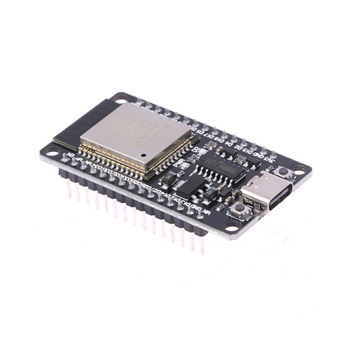

  

  <strong>Team LazyGo</strong> is a robotics team from <strong>Bangladesh</strong>. Originally formed in 2022, LazyGo won <strong>3rd place</strong> at the Future Engineers category of the World Robot Olympiad International Round. Now the team returns again with three experienced international participants.
  

We named our robot **LazyBot**, which is built for the **Future Engineers** category in the **World Robot Olympiad 2025**. This year, we are trying to bring some interesting changes from the typical way a robot is built for this category. Definitely check out [Odometry Calculation](#odometry), [Disparity Extender Algorithm](#avoidance-using-lidar), and [LiDAR Based Tower Detection](#obstacle-round) algorithms.

This repository contains all the files, codes, models, photos and everything about our team and the robot.

Visit our team socials:

## Table of Contents

- [`Team Introduction`](#team-introduction)
- [`Mission Overview for WRO Future Engineers Rounds`](#mission-overview-for-wro-future-engineers-rounds)
- [`Repository`](#repository)
- [`Key Features`](#key-features)
- [`Components and Hardware`](#components-and-hardware)
- [`Algorithm`](#algorithm)
- [`Mobility Management`](#mobility-management)
- [`Power and Sense Management`](#power-and-sense-management)

---
## Team Introduction

   
  <strong>Iqbal Samin Prithul</strong> 
  Embedded Electronics 
  WRO 2022 International 3rd Place (Future Engineers Category) 
  <a href="mailto:prithul0218@gmail.com">prithul0218@gmail.com</a>

 

---

   
  

  <strong>A.N.M Noor</strong> 
  Software and ROS 
  WRO 2023 International Participant (Future Engineers Category) 
  <a href="mailto:noornoorrohan15@gmail.com">noornoorrohan15@gmail.com</a>

 

---

   
  <strong>Rakibul Islam</strong> 
  Hardware and CAD design 
  WRO 2024 International Participant (Future Engineers Category) 
  <a href="mailto:rakibul.rir06@gmail.com">rakibul.rir06@gmail.com</a>

 

---

---

## Mission Overview for WRO Future Engineers Rounds

<table>
  <tr>
    <td width="50%" valign="top" align="center"><h3>🏁 Round 1: Lap Completion</h3></td>
    <td width="50%" valign="top" align="center"><h3>🏆 Round 2: Lap Completion with Obstacle Avoidance and Parking</h3></td>
  </tr>
  <tr>
    <td width="50%" valign="top" align="left">
      
In <strong>Round 1</strong>, the robot must autonomously complete <strong>three laps</strong> on a pre-defined track. The goal of this round is for the bot to demonstrate stable navigation and precise lap tracking without any obstacle avoidance requirements.

      <ul>
        <li><strong>Objective</strong>: Complete three laps on the track within the allotted time.</li>
        <li><strong>Key Tasks</strong>: Accurate path-following, speed control, and lap counting.</li>
      </ul>
      

            
        
      

    </td>
    <td width="50%" valign="top" align="left">
      
In <strong>Round 2</strong>, the bot must complete <strong>three laps</strong> while avoiding green and red obstacles:

      <ul>
        <li><strong>Green Obstacles</strong>: The bot should move <strong>left</strong> to avoid.</li>
        <li><strong>Red Obstacles</strong>: The bot should move <strong>right</strong> to avoid.</li>
      </ul>
      
After completing the laps, the bot must accurately park within a designated zone.

      <ul>
        <li><strong>Objective</strong>: Complete three laps, avoid obstacles, and park in the designated area.</li>
        <li><strong>Tasks</strong>: Obstacle detection, color-based avoidance, and precision parking.</li>
      </ul>
      

        
      

    </td>
  </tr>
</table>

---
>[!IMPORTANT]
>**Important: WRO Future Engineers Rulebook**
>* **Thorough Reading:** Ensure that you thoroughly read the **WRO Future Engineers 2025 Rulebook** to understand all rules and guidelines.
>* **Official Link:** Access the rulebook here: [🔗 WRO Future Engineers 2025 Rulebook](https://wro-association.org/wp-content/uploads/WRO-2025-Future-Engineers-Self-Driving-Cars-General-Rules.pdf).

---
## Repository

This repository includes all files, designs, and code for **LazyBot**, our WRO 2025 robot.

### File Structure

Here’s a breakdown of the project folders:

- **[`assets`](./assets/)**: Contains all the images used in the README files of this repository.
- **[`instructions`](./instructions/)**: Contains all the instructions on how to setup and use the package.
- **[`models`](./models/)**: Contains 3D models and CAD designs of the robot.
- **[`src`](./src/)**: Source code for the robot's programming. This contains the ROS2 packages.
- **[`t-photos`](./t-photos/)**: Technical images of the robot build.
- **[`v-photos`](./v-photos/)**: Visual photos for aesthetics and showcasing.
- **[`video`](./video/)**: Performance and demo videos of LazyBot.

---
---

## Key Features

- **`Hybrid LEGO & 3D Printed Design`**: Using LEGO parts proved to be very helpful based on the previous experience of our members. That, along with 3D printed parts made it possible to harness LEGO's precision and the flexibility of 3D printing.
- **`Advanced Sensor Suite`**: LazyBot is equipped with a LiDAR (to perfectly sense the surroundings), encoder motor (to precisely calculate the position), IMU (to calculate realtime orientation).
- **`Use of Robot Operating System`**: We used ROS2 to control the robot. We took this decision because Robot Operating System allows to make a project very modular and provide a lot of useful tools for simulation and visualization.
- **`Real-Time Odometry Calculation`**: This is one of the major feature of our robot. Using the onboard IMU sensor and the value from the motor's encoder, the robot calculates the exact realtime position of the robot.
- **`Efficient Debugging`**: We've added an OLED display to the MCU of the robot which helps to debug the issues on the MCU side. And ROS2 provides a lot of debugging tools that helps us debug any issues happening on the Pi side.

---
---

## Components and Hardware

Our bot is equipped with various components that support its autonomous functionality. The table below summarizes each module with a concise role and mounting approach:

<table>
  <thead>
    <tr>
      <th>Image</th>
      <th>Component</th>
      <th>Price</th>
      <th>Role / Function</th>
      <th>Mounting</th>
    </tr>
  </thead>
  <tbody>
    <tr>
      <td>

</td>
      <td><a href="https://www.aliexpress.com/item/1005008153885728.html">Raspberry Pi 5</a></td>
      <td>$100.00</td>
      <td>High‑level processing (ROS2, vision, LiDAR integration). 8GB RAM for parallel tasks.</td>
      <td>3D printed middle chassis plate + 4× M2.5 standoffs & screws.</td>
    </tr>
    <tr>
      <td>

</td>
      <td><a href="https://www.aliexpress.com/item/1005007915572042.html">RPLidar C1</a></td>
      <td>$67.87</td>
      <td>360° environment scan for obstacle mapping & tower shape profiling.</td>
      <td>Top cover LiDAR mount, 4× M2.5 screws. Resting on middle layer tray for support.</td>
    </tr>
    <tr>
      <td>

</td>
      <td><a href="https://www.aliexpress.com/item/1005005033359539.html">Logitech C270 Camera</a></td>
      <td>$24.76</td>
      <td>Color tower detection (masking & confirmation).</td>
      <td>Mounted on 3D printed pan servo mount with single screws for angle adjustment.</td>
    </tr>
    <tr>
      <td>

</td>
      <td><a href="https://www.aliexpress.com/item/1005006826620736.html">ESP32 Microcontroller</a></td>
      <td>$7.38</td>
      <td>Real‑time motor, encoder, IMU, servo & OLED interface; low‑level comms.</td>
      <td>Soldered to custom secondary PCB under top cover.</td>
    </tr>
    <tr>
      <td>

</td>
      <td><a href="https://www.aliexpress.com/item/1005009534591471.html">BNO055 9‑Axis IMU</a></td>
      <td>$22.28</td>
      <td>Orientation & fused heading for odometry; low drift angle source.</td>
      <td>Center (slightly left) of PCB for vibration isolation; header pins + foam tape as spacer for mild vibration dampening.</td>
    </tr>
    <tr>
      <td>

</td>
      <td><a href="https://www.aliexpress.com/item/1005008934254841.html">1.3" OLED (I2C)</a></td>
      <td>$5.83</td>
      <td>Live status: sensor readouts, battery warnings, debug info.</td>
      <td>Vertical raised header on PCB rear edge + friction with top cover.</td>
    </tr>
    <tr>
      <td>

</td>
      <td><a href="https://www.aliexpress.com/item/1005008785628197.html">5V 20A Buck Converter</a></td>
      <td>$6.21</td>
      <td>Primary regulated 5V rail for Pi (headroom for peaks).</td>
      <td>Middle chassis plate with double sided tape.</td>
    </tr>
    <tr>
      <td>

</td>
      <td><a href="https://www.aliexpress.com/item/1005008477697348.html">5V 5A Buck (SCT2650)</a></td>
      <td>$3.99</td>
      <td>Secondary regulated supply for noise generating components (Servo, peripherals).</td>
      <td>Bottom of PCB (to save space).</td>
    </tr>
    <tr>
      <td>

</td>
      <td><a href="https://www.aliexpress.com/item/1005008766288833.html">25GA Gear Motors + Encoder</a></td>
      <td>$9.65</td>
      <td>Drivetrain torque + linear displacement feedback for odometry.</td>
      <td>Captured in printed motor housings; 2× M3 screws.</td>
    </tr>
    <tr>
      <td>

</td>
      <td><a href="https://www.aliexpress.com/item/1005006213746966.html">VNH2SP30 Motor Driver</a></td>
      <td>$18</td>
      <td>High‑current brushed DC control (PWM + direction + protection).</td>
      <td>Screwed to the bottom of the second/middle layer.</td>
    </tr>
    <tr>
      <td>

</td>
      <td><a href="https://www.aliexpress.com/item/1005002533411942.html">PS1171MG Servo</a></td>
      <td>$16.00</td>
      <td>Steering actuation & camera pan positioning.</td>
      <td>3D printed steering bracket/3D printed LiDAR bracket with integrated servo hole. 2× self‑tapping screws each.</td>
    </tr>
    <tr>
      <td>

</td>
      <td>Custom Secondary PCB</td>
      <td>N/A</td>
      <td>Integration hub: ESP32, IMU, OLED, some power distribution, headers and lots of capacitors.</td>
      <td>Four M3 standoffs to chassis mid‑deck and top cover.</td>
    </tr>
    <tr>
      <td>

</td>
      <td><a href="https://www.aliexpress.com/item/1005007345491844.html">LEGO Differential (Gen 3)</a></td>
      <td>$1.84</td>
      <td>Allows inner/outer wheel speed difference for smooth turning.</td>
      <td>Seated in printed cradle; retained by axle bearings (friction).</td>
    </tr>
    <tr>
      <td>

</td>
      <td>3D Printed Body Frame</td>
      <td>Varies</td>
      <td>Structural chassis: mounting surfaces, protective shell. 3 Layer design.</td>
      <td>Base structure (printed as modules with minimum support); screw or snap‑fit/friction.</td>
    </tr>
  </tbody>
</table>

> More details on the Power and sensing components can be found below.
---

## Algorithm and Software
ROS2 underpins our control system, letting us split functionality into modular nodes. Real‑time odometry (encoder + IMU) drives lap counting and parking logic. Tower detection combines LiDAR shape cues with camera color checks. Gazebo simulation allowed rapid iteration before deploying to hardware.
> [**More details on software is in the `/src` directory.**](/src/)

## **Mobility Management**

This segment outlines the mobility system of **LazyBot**, with two key features: a differential gear system, and Ackermann steering. But first, a little bit about our chassis design and motors:
### The Chassis Design
The LazyBot chassis was designed completely from scratch on OnShape 3D for online collaboration and ease of use on lower end computers. The robot has 3 separate layers, which are held together using M3 metal standoffs.
1. **First/Bottom layer:** 
     - 5mm above ground.
     - 3mm thick 3D-printed sheet with mounting holes.
     - Holds steering mechanism + servo motor, LiPo Battery, main differential drive +25GA motor.
2. **Second/Middle Layer:**
   - 36mm above the bottom layer.
   - 3mm thick 3D-printed sheet with mounting holes.
   - Holds Raspberry Pi 5, 5V 20A buck converter, VNH2SP30 motor driver.
   - Supports LiDAR from the bottom.
3. **PCB and top cover:**
   - 30mm above the second layer.
   - Acts as the third layer, with a light 3D printed top cover 15mm offset from the top of the PCB.
   - The top cover also mounts the LiDAR and camera pan servo.

#### **Step-by-step assembly:**
Assembly of the robot is simple as it is built from the bottom up. The first layer can be assembled first with all the components it holds and the wheels installed. Adding the standoff to the bottom layer - we can continue to the second layer, which should be partly pre-assembled with the motor driver at the bottom and the buck converter + Raspberry Pi 5 mounted at the top. At this point, partial wiring can be done between the first and second layer. Then, the PCB is assembled at the top with 30mm standoffs. Upon connecting all the cables to the PCBs using JST connectors, the top cover is mounted with preinstalled LiDAR. The camera pan servo should be pre-inserted into the top cover with its dedicated wire routing slot. Then, everything can be closed off with appropriate wiring through the wiring holes/slots. We recommend checking out our complete 3D model if you get stuck at any step.

### The 25GA370 Motor

DC motors provide the best balance between performance, complexity and budget for the main drive train. So we initially wanted to use a 20GA motor for its torque, speed, and size being just right from our experience. However, after our first 20GA sized motor from China refused to stop working, we had to resort to the more commonly and locally available 25GA motor. 

The motor provides sufficient torque at slow speeds with decent maximum speeds. The encoder, with its roughly 1870 ticks per meter precision, does a great job at measuring robot precision at millimeter level accuracy.

### Servo Selection:
Since we are using two servos in our system, we decided to use the same servo for both mechanism to allow for less individual part count. The PS-1171mg was an excellent choice, available in the Bangladeshi local market. Its metal gears give us peace of mind, and 0.13sec/60° movement speed was adequate for our robot.

### Differential Drive System

Our robot utilizes a **3rd generation LEGO differential gearbox**. Differential drive is a crucial feature for smooth cornering and precise movements. The Lego Gearbox is small with low backlash, something we were not able to achieve with gears printed on our 3D printer.

<table>
<tr>
<td width="50%">

#### How It Works:
- The motor is connected to the differential gearset using a matching 20 teeth 3D printed gear. The gear system transfers torque from the motor to the gearbox with a **1:1.2** ratio.
- The differential automatically compensates for wheel speed differences when turning.
- Encoder readings stay accurate as it records roughly the average speed of the two wheels.

#### Benefits of our drive train:
1. **Smooth Turning**: Independent wheel speeds allow efficient navigation.
2. **Precise Odometry**: Encoders enhance path planning and tracking.
3. **Compact & Modular**: LEGO-based integration makes the drivetrain easy to modify and assemble.
4. **Freedom to change gear ratio**: 3D printing one gear allowed us to change the gear ratio, as our motor was just a tad bit too fast.

  

</td>
<td width="50%">

  
   
  A 20GA Motor was being used when we took this picture.

</td>
</tr>
</table>

### **Steering System - 3D Printed Ackermann Mechanism**

The robot features a **3D printed Ackermann steering system** controlled by a **servo motor**. This configuration allows the front wheels to turn at appropriate angles during a corner, minimizing tire slippage and improving steering accuracy.

##### Advantages:
1. **Sharper turns**: While not important in such small scale, the mechanical efficiency that comes with the Ackermann design allows sharper turns.
2. **Customizable Design**: 3D printed components allowed fine-tuning and easy iteration.
3. **Precise Control**: Servo-driven mechanism ensures consistent and accurate angle adjustments.
4. **Adjustable links**: We used off-the-shelf RC car links to connect the servo to the steering knuckles.

  

---
---

## Power and Sense Management

Our robot has been designed to optimize performance while ensuring reliable power delivery, precise sensing, and efficient communication between components.

It is powered by a 3-cell lithium battery. Two dedicated buck converters for high and low noise devices. This structure ensures stable operation across core modules like the Raspberry Pi 5, RPLidar, ESP32, sensors, and motor systems. The decision to use separate buck converters was made when we found out that the servo motors can take a significant amount of in-rush current, which was causing our Raspberry Pi to throttle, and ESP32 to go into brownout detection causing a reset.

Below is the complete schematic of the PCB. External to the PCB, we have the 5V 20A buck converter, and a DC motor driver.

---

  

### Here is a detailed explanation of the power and sense components:

#### **1. Power Source: 3-Cell Lithium Polymer Battery**
- **Configuration**: 3S (3 cells in series)
- **Voltage**: 12.6V (fully charged) → ~11.1V (nominal) → ~9.9V (discharged)
- **Benefits**:
  - High energy density
  - Sufficient current delivery for high-load components like Motors, Pi and LiDAR
  - Rechargeable and easily sourceable

---

#### **2. Main 5V 20A Buck Converter (Unknown chip)**
- **Purpose**: Supplies 5.1V to **Raspberry Pi 5, RPLidar C1, and ESP32**
- **Input**: Directly from the 3S battery (~12.6V max)
- **Output**: Stable 5.1V 
- **Benefits**:
  - Ensures separate 5V with separate ground path so that the servo current does not affect other modules. 
  - Enhances RPLidar C1 and Encoder precision with reduced noise.

---

#### **3. Secondary 5V 5A Buck Converter (SCT2650)**
- **Purpose**: Supplies 5V to **Servo, OLED, Buzzer**
- **Input**: Directly from the 3S battery (~12.6V max)
- **Output**: Rush currents at 5V / 5A
- **Benefits and reason to choose**:
  - The SCT2650 is a near-identical copy of the Texas Instruments TPS54560 chip, efficient design.
  - Chosen for it's excellent noise free design with multiple capacitors in series, and high current Schottky diode.
  - There is no overcurrent protection false-triggering when the servos draw sudden in-rush current. This is an issue we had before with the Mini 560 Buck converter.

---

#### **4. VNH2SP30 Motor Driver with Built-in Regulator**
- **Purpose**: Drives the **25GA motor**
- **Regulation**: Built-in buck handles motor voltage directly from the 3S battery
- **Features**:
  - No external 5V needed
  - Simplifies wiring and improves efficiency
  - Has very low RDS(on) resistance with integrated protections
  - Something we had easy access to in the market :)

---

### Voltage Distribution Table

| Component                     | Voltage Supplied | Power Source / Converter        |
|-------------------------------|------------------|----------------------------------|
| **Raspberry Pi 5**            | 5.1V*               | Unknown chip 5A Buck             |
| **RPLidar C1**                | 5.1V*              | Unknown chip 5A Buck             |
| **ESP32 + Sensors**    | 5.1V*               | Unknown chip 5A Buck             |
| **Servo Motor + OLED**               | 5V               | SCT2650 5A Buck                  |
| **Motors (25GA with encoder)**| Battery Voltage  | VNH2SP30 Motor Driver (built-in) |

> ***The 5V 20A buck converter module has a 2.8V-5.6V adjustable potentiometer, which allows us to conveniently set the voltage to 5.1V. This helps avoid throttling on the pi caused by voltage drop on the wire and PCB.**
#### Flowchart for ease of understanding:

---
---

## Custom Homemade PCB
Since SMD PCB manufacturing is not available to public in Bangladesh, and services like JLCPCB are extremely expensive due to unfair customs taxes, we had to design our own through hole PCB and manufacture it right at home.

The PCB is designed to use locally available components, with a lot of board clearance to allow us to etch the PCB using ferric chloride. The process included:
1. Printing a mirrored black and white version of the copper traces on a glossy paper.
2. Transferring the ink onto the PCB using an iron on the PCB with the glossy paper sandwiched in between.
3. Fixing minor transfer errors with a permanent black marker.
4. Etching the PCB in a ferric chloride solutions for a fixed amount of time (gained through experience).
5. Cleaning up the board with isopropyl alcohol and mildly sanding the copper to clear oxidization.
6. Applying a thin layer of resin to coat the copper traces.

### PCB Views

| **Top View of the PCB**                 | **Bottom View of the PCB**             |
|-------------------------------------|-------------------------------------|
|  |  |

---
---

Thank you for going through our documentation! If you want to learn more, please reach out to us through our socials media accounts:

- [facebook](https://www.facebook.com/team.lazygo)
- [linkedin](https://www.linkedin.com/company/lazygo)
