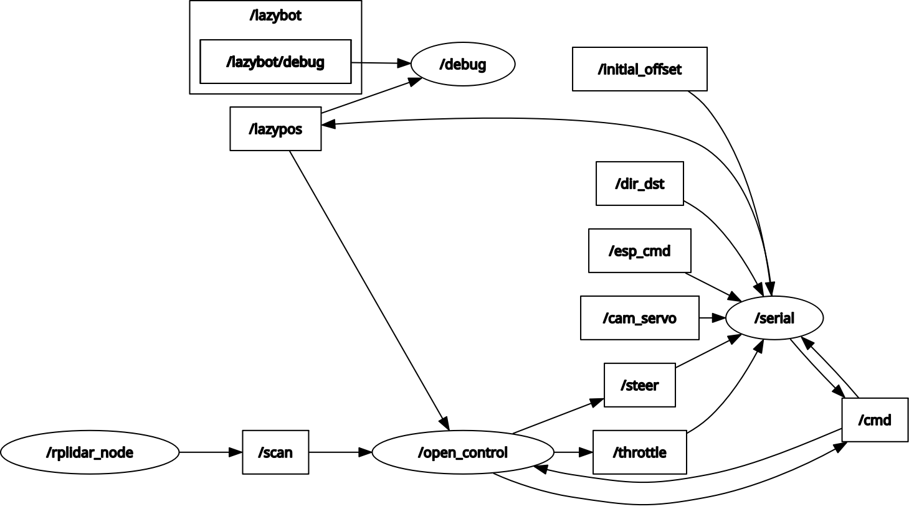
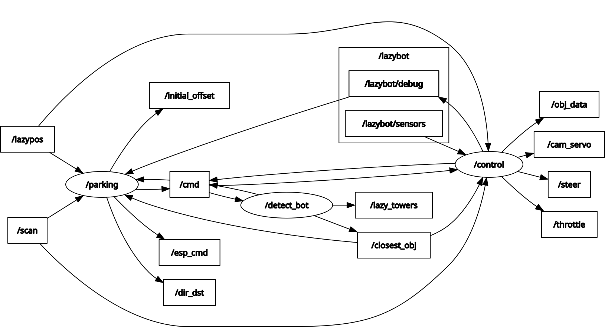
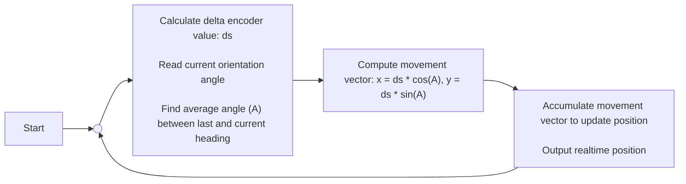
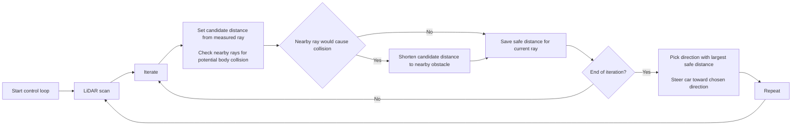
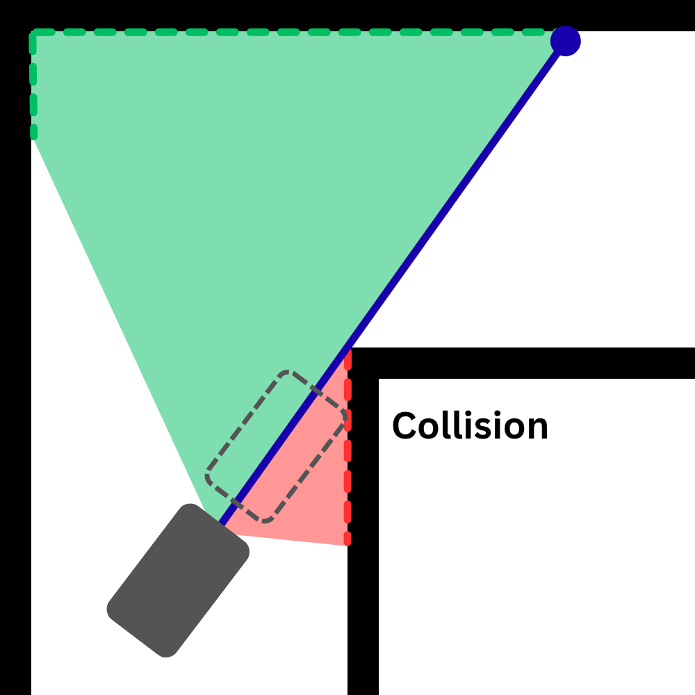
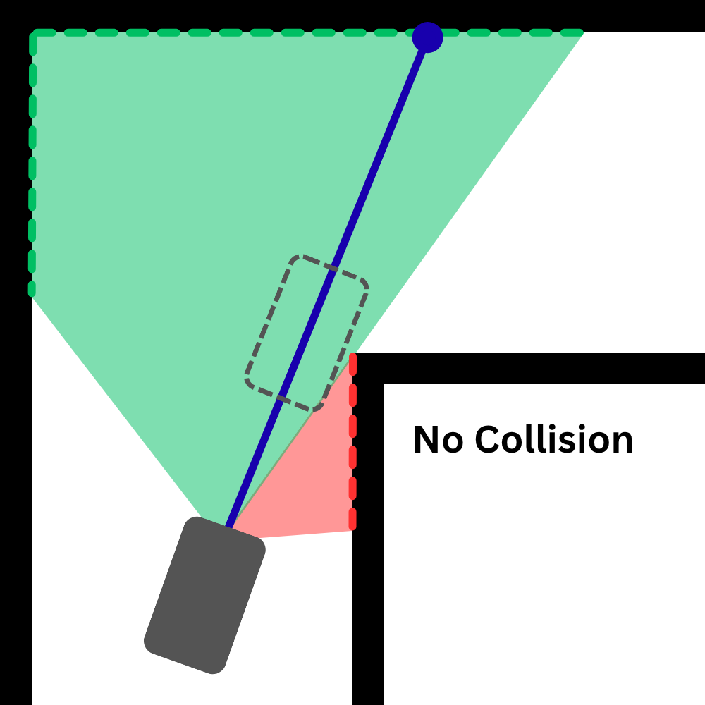
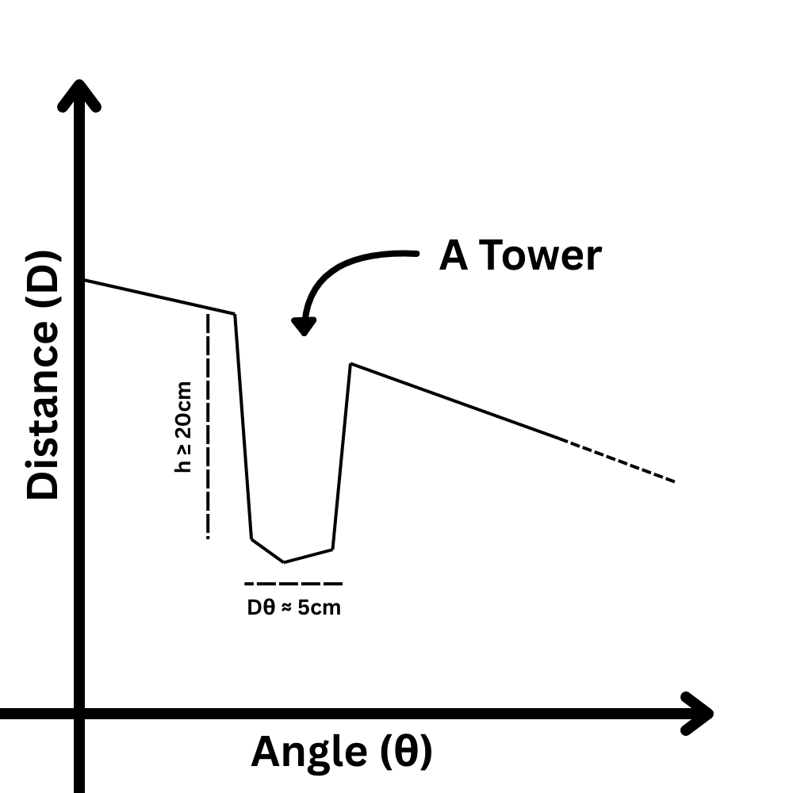
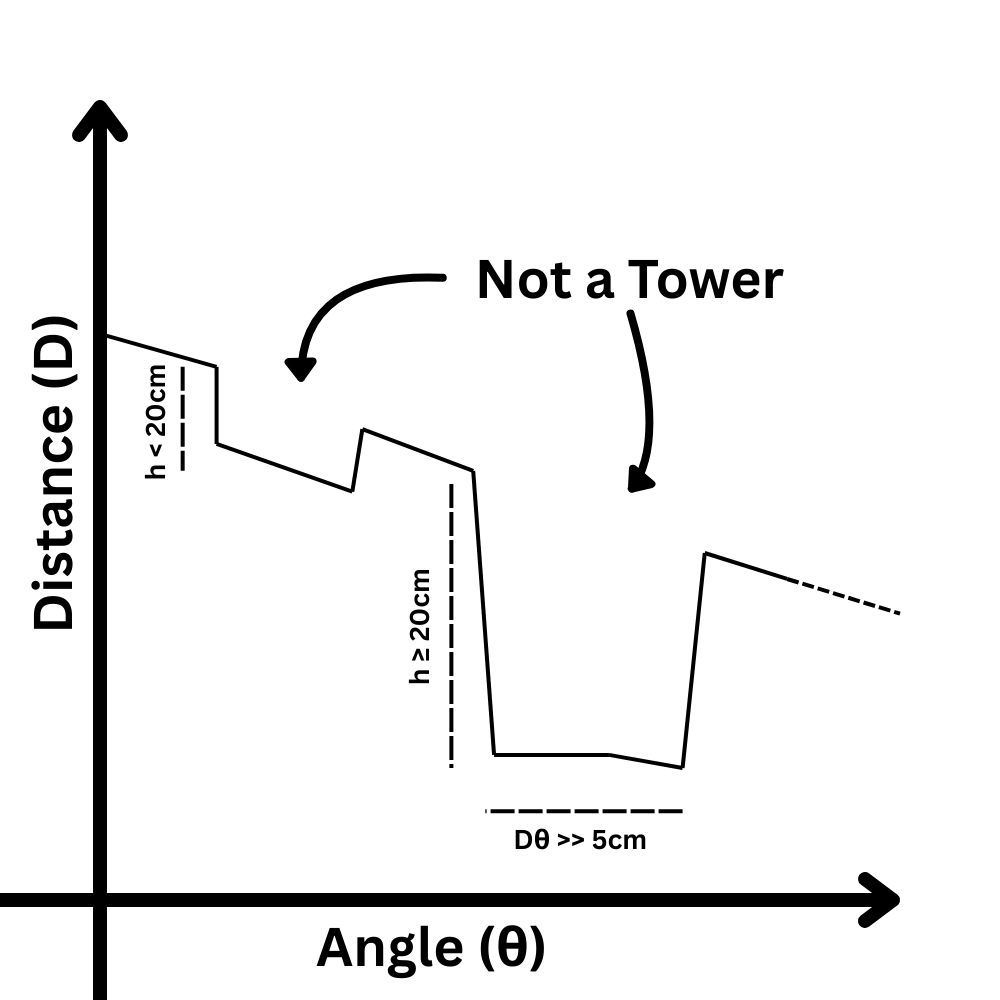
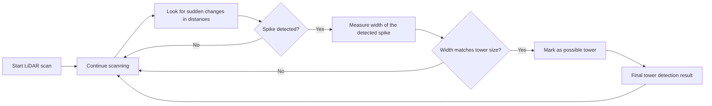
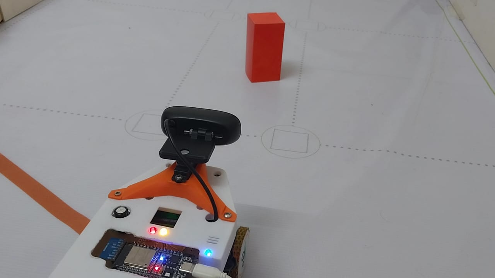

# Codebase of LazyBot
This directory contains all the code of LazyBot (By Team LazyGo)

File structure:
```
src
├── ESP32 Code                          (PlatformIO Project for the ESP32)
│   └── src/                            (Contains the C++ code for ESP32)
|
├── lazy_interface/                     (ROS Package - Message Types)
│   ├── msg/                            (Contains custom message types used by ROS to control the robot)
│   └── srv/                            (Currently, we're not using any custom ROS services)
|
├── lazybot/                            (ROS Package - Control Package)
│   ├── launch/                         (Contains launch files to launch necessary nodes together)
|   |   ├── open.lazy_launch.py         (Launch file for open challenge)
|   |   ├── robot.lazy_launch.py        (Launch file for obstacle challenge)
│   |   └── sim.lazy_launch.py          (Launch file for simulation run)
|   └── lazybot/                        (ROS Nodes - contains all the code files for control package)
|
└── lazysim/                            (ROS Package - Gazebo Simulation)
    ├── config/                         (Configure files for the simulation)
    |   └── track.yaml                  (Configure the simulated track)
    └── launch/                         (Contains launch files to launch necessary nodes together)
        ├── control.launch.py           (ROS-Control package launcher: This is needed to control the robot in simulation world)
        ├── gazebo.lazyBot.launch.py    (Launches the simulation world with robot model)
        ├── lazySim.launch.py           (Only launches the robot model.)
        └── rviz_lazySim.launch.py      (Launches RVIZ with appropriate topics and settings)
```

# Software Decisions

This time, software wise, we focused on a few specific aspects of the robot. Even though each member worked in different areas, we all had some goals in mind. For the software part, we wanted to make sure of the following things:
- **Reliability:** The robot should be very reliable. It cannot behave randomly on different times. Even if the robot doesn't work the issues should be reproducable. Hence, we decided to use ROS2 because it enabled us to test individual parts of the robot and merge them into a robust piece of software. More on this [later...](#why-ros2)
- **Accurate Range Sensor:** The distance calculations must be accurate and reliable in order for the softwer to meet our requirements. We need something more reliable that ultrasonic distance sensors. Therefore, we decided upon using a LiDAR. We choose RPLiDAR C1 because, well, it was the cheapest option! But considering the price, it performs really well. The output point cloude is very clean and noise free. Only issue is that the scan rate is only 10Hz. But overall we believe it was a good decision. ROS2 was useful here as well as RPLiDAR has a existing ROS Package to use their LiDARs.
- **Odometry:** We wanted to have accurate odometry calculation for the robot's movement. This was done using a fusion of IMU sensor values and motor encoder values. The detailed [algorithm](#odometry) is explained below.
- **ESP32 as a 2nd Brain (Backbone!):** We cannot directly control the actuators from the Raspberry Pi. A regular microcontroller gives far more control over its GPIO pins than a Pi does. Currently, we are extensively using the ESP32 microcontroller's FreeRTOS feature to manage different tasks like keeping serial communication, reading sensor data, showing debug info on an OLED display, etc. Even though we initially wanted to use an ESP32 only for controlling the motors and getting sensor data, we later offloaded a few logic elements to the ESP as well. The tasks that require instant reaction—mainly the parking tasks—are handled mostly by the ESP32.
- **Object Detection Issues:** From previous experience, we know that detection of the towers can be very tricky sometimes. Because we found the objects given during the international round to be very dark for the camera to properly detect them, we spent a lot of time thinking about a possible solution for this. In the end, we decided to use a lower FOV camera with a servo to directly look at a target object and detect its color. The [algorithm](#obstacle-round) for this is explained in detail below.
- **Gazebo Simulation:** Due to academic reasons, the main programmer of our team, Noor, had to stay away from the team for a residential semester. During that time, he did not have access to the physical robot, which made it very difficult for him to program the logic for the robot. So he set up a Gazebo simulation environment and perfected the robot's logic there. When he finally had access to the robot, he implemented the code on the physical robot. ROS2 was very useful here as well. As Gazebo is compatible with ROS2, the same code used for the simulation could also be used for the robot as well.


### Why ROS2
ROS2 (Robot Operating System 2) is a flexible, open-source framework for writing robot software. It provides a collection of tools, libraries, and conventions that simplify the complex task of creating robust and scalable robotic systems. 

In ROS2, different programs simultaneously run as independent nodes that communicate via various middleware interfaces. Many off-the-shelf components also have dedicated ROS2 packages that make it simple and easy to use them. ROS2 also comes with a number of debugging tools like rqt-graph, topic echo, rviz, etc. ROS2 sends its messages over the local network, which makes it possible to debug a robot from a different device just by connecting them to the same network. Now, our robot mainly has three types of nodes running: one for serial communication with the ESP32, one for using the camera for object detection, and one for deciding how the robot should move. To give an example, we separated the logic for regular control and parking control into two different nodes. Even though they share information between each other, they can also work independently. So even if we make a few changes to one of them, the other one isn't affected. It also means we can run only the parking node and test the parking portion without doing the whole run over and over again.

As mentioned before, ROS uses a node-based approach where multiple nodes each solve one specific task. But they also share information (i.e. sensor data, odom data, specific commands, etc). This information is called "messages," and it is shared through topics. Multiple nodes can share information on a topic and multiple nodes can subscribe to it as well. ROS2 provides a utility called `rqt_graph` which shows a graph of all the running nodes and the topics.

<table>
    <tr>
        <td align="center">
            
        </td>
        <td align="center">
            
        </td>
    </tr>
    <tr>
        <td align="center"><sub>This is the state of ROS2 when open challenge is running</sub></td>
        <td align="center"><sub>This is the state of ROS2 when obstacle challenge is running</sub></td>
    </tr>
</table>


### Odometry
A really interesting feature of our robot is that it can calculate it's realtime position. We achieved this by fusing the realtime orientation value with the motor's encoder values. When the robot is moving in a straight line, it is possible to calculate how far the robot has moven using the encoder values. But it is not so simple when the robot turns while moving. So when the robot is turning, we can actually divide it's curved path into tiny sentions that resembles a straight lines. Then accumulating those straight lines and taking their directions into account, we can find the actual cartesian displacement of the robot with reliable precision.

Here's how it is calculated:
1. Find the delta of the encoder's value. Let's call it `ds`
1. Find the average angle between the last calculation and current heading angle. Let's call it `A`.
1. The movement vector would be: _(x = `ds*cos(A)`, y = `ds*sin(A)`)_
1. By accumulating this movement vector, and we can find the realtime position of the robot.

Before getting a usable value, we had to calibrate our encoder to calculate values in metric units.



### Open Round

#### Avoidance using LiDAR
During the open round, there are no towers on the track. So we don't need the camera. To move the robot in the track, we use a modified version of `Disparity Extender` algorithm. Here's a step by step description of the idea:

1. The LiDAR scans the area and gives a bunch of distances in many directions (one distance per ray).
1. For each ray, start with the ray’s measured distance as the “candidate” distance.
1. Look at the nearby rays around that ray. If any nearby ray’s obstacle is close enough that the car’s body would hit it when moving along the candidate ray, shorten the candidate distance to that nearby obstacle. (In other words: pretend the car is wide and see where it would first hit something.)
1. After doing that for every ray, you have a “safe distance” for every direction — the farthest you can travel in that direction without your body hitting something.
1. Pick the direction with the largest safe distance and steer the car toward it.



One drawback of this method is that on straight sections, the robot shows a tendency to point itself toward the next corner. This happens because corners often look like the direction with the most open space before discovering the next turn, so the algorithm treats them as the safest option—even though the robot should ideally stay centered on the straight path. But this algorithm works really well to move between tight gaps. So the little drawback doesn't really matter to us. And of course, there are ways to improve on this issue.

One important thing to remember, the robot does not target the farthest distance, it targets the farthest `safe` distance - where it can move to without collision. Here's how it works:

<table>
    <tr>
        <td align="center">
            
        </td>
        <td align="center">
            
        </td>
    </tr>
    <tr>
        <td align="center"><sub>Targeting farthest distance</sub></td>
            <td align="center"><sub>Targeting farthest `safe` distance</sub></td>
    </tr>
</table>

#### Lap Count
Because we can precisely calculate odometry, keeping lap count is a very simple task. The robot just keeps track of how many times it passes through the starting section. When it reaches the desired lap count, it just stops there. And it worked really well. The robot always stops between a few centimeters from the dead center of the starting section.

### Obstacle Round
It works similarly to the open round. But the robot needs to detect the towers. In our robot, tower detection is done in two ways.

1. `Using the camera`: This is a very basic color detection algorithm. From the camera feed, the robot detects the towers by masking colors.
1. `Using LiDAR data`: This approach is a bit more interesting. Towers create sudden changes (valley) in the LiDAR distance readings. If the readings suddenly get closer and then farther again, that usually means there’s an object in between. By checking how wide this change looks from the LiDAR’s point of view, we can estimate whether it matches the expected size of a tower. The object's size can be easily calculated using the formula `s = rθ`. If the size is around 5cm (width of a tower) the robot marks it as a possible tower. But it still confirms the color with the camera to be sure.

Here's how it works:

<table>
    <tr>
        <td align="center">
            
        </td>
        <td align="center">
            
        </td>
    </tr>
    <tr>
        <td align="center"><sub>The valley has a depth of more than 20cm and the calculated size is around 5cm</sub></td>
        <td align="center"><sub>These are not towers because either the valley depth is lower than 20cm, or the calculated size is much different from 5cm.</sub></td>
    </tr>
</table>




After detecting the towers, the robot needs to avoid them. The robot needs to move to the left of green objects. So what it does, it imagines a wall at the right of any green tower. That way, the robot is forced to pass the object from the left side. The opposite happens for red towers.


#### Parking
We thought parking would be very difficult, but it was pretty simple. Moving out of the parking spot was straightforward. Although we had to choose the path based on the color of the first object, it was fairly simple.
However, moving into the parking spot after the run ends—and being parallel on top of that—was no simple matter. But we already had odometry data, motor encoder data and IMU orientation data. All we had to do was first align the robot in a specific arrangement with the parking spot and run a predetermined movement sequence. And that's all it took to complete the parking.

Here's how it works:
<table>
    <tr>
        <td align="center">
            
        </td>
        <td align="center">
            
        </td>
    </tr>
    <tr>
        <td align="center"><sub>The robot stops using the odometry values.</sub></td>
        <td align="center"><sub>The robot turns such a way that it remains around 40cm away from the parking adjacent wall</sub></td>
    </tr>
</table>
<table>
    <tr>
        <td align="center">
            
        </td>
        <td align="center">
            
        </td>
    </tr>
    <tr>
        <td align="center"><sub>The robot moves to a certain position in front of the parking.</sub></td>
        <td align="center"><sub>The robot directly moves into the parking spot</sub></td>
    </tr>
</table>

<table>
    <tr>
        <td align="center">
            
        </td>
        <td align="center">
            
        </td>
    </tr>
    <tr>
        <td align="center"><sub>From there, it moves back and forth...</sub></td>
        <td align="center"><sub>...Until it is completely straight.</sub></td>
    </tr>
</table>


## Important Note on the Camera

We attached the robot's main camera on a servo motor. Since we are detecting the towers' positions using the LiDAR values, we can easily point the camera towards the closest object using the servo. This makes it super easy to isolate a target tower. And allows us to use a lower Field of View (`FoV`) camera and cover a large area.

#### But does using a low `FoV` camera have any benefits?

Fish eye lenses with high `FoV`s introduce a lot of distortion. It can be fixed by calculating the lens intrinsics and camera matrix coefficients, but that also takes up some processing time as it needs to be done for every frame. It is not too big of an issue if you just need to use color masking with OpenCV. However, there is another issue with high `FoV` cameras. <br><br>
Generally, cameras with a higher `FoV` have lower image brightness (per unit area) if other settings (such as aperture and exposure time) remain the same. This is because the same amount of light gathered by the lens is distributed over a larger sensor area. <br><br>
We can increase the exposure, but that increases motion blur and sometimes even introduces lag. This is an issue especially for the WRO Future Engineers Category. Over the years, we've noticed that the tower colors are usually very dark. This makes it tricky to detect their colors, and differentiate them from the black wall. Here, a camera with more overall brightness will perform better than one with a lower overall brightness. So a low `FoV` camera helps in this sense as well. 

In addition, as we directly point the camera towards a tower, we put the color detection object in the center of the camera field of view, reducing the risk of detecting other things around the robot. Our robot doesn't even look at them! 🗿🗿


> **TL;DR:** Higher `FoV` cameras distribute light over a higher area, reducing overall picture brightness. The LazyBot uses lower `FoV` camera points it at target objects to tackle low light conditions.

Here, see it in action (click for YouTube Video):

<p align="center">
  <a href="https://youtu.be/Rp4g42Nrq9Q">  </a>
</p>