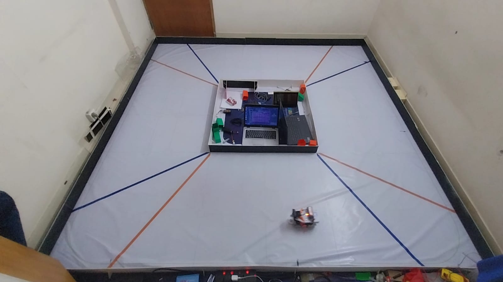
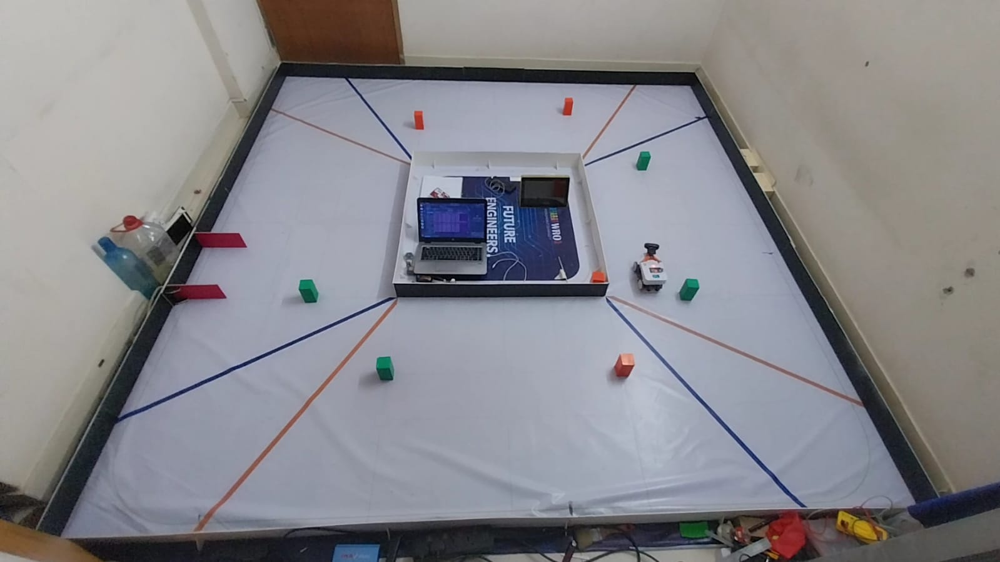

# Performance Videos
Performance videos of our robot during the Open Challange and the Obstacle Challange:

<table>
    <tr>
        <td align="center">
            
        </td>
        <td align="center">
            
        </td>
    </tr>
    <tr>
        <td align="center">Open Challenge Performance Video</td>
        <td align="center">Obstacle Challenge Performance Video</td>
    </tr>
</table>

# Simulation Videos
Initially we implemented all the logics on a simulated robot. Here are some screen recordings of those simulations:

<table>
    <tr>
        <td align="center">
            
        </td>
        <td align="center">
            
        </td>
        <td align="center">
            
        </td>
        </tr>
    <tr>
        <td align="center">Open round, without lap count</td>
        <td align="center">Open round, with lap count</td>
        <td align="center">Obstacle round</td>
    </tr>
</table>

# Additional Videos
Here are a few videos demonstrating different aspects of our robot:

<table>
    <tr>
        <td align="center">
            
        </td>
        <td align="center">
            
        </td>
    </tr>
    <tr>
        <td align="center">We're using LiDAR to detect the position of the objects, This video demonstrates that. Find more <a href="../src/README.md/#important-note-on-the-camera">here...</a></td>
        <td align="center">This video demonstrates our parking approach for the obstacle round. Learn more about this <a href="../src/README.md/#parking">here...</a></td>
    </tr>
</table>