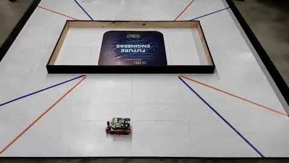
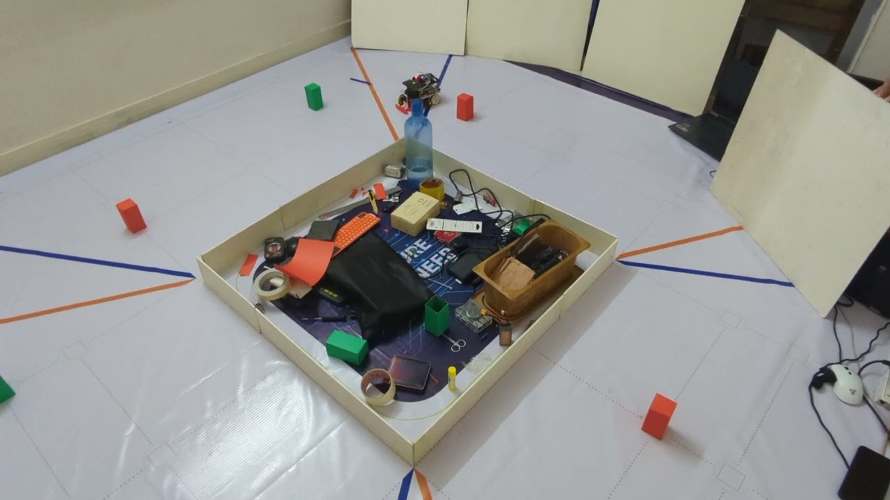

# Performance Videos
Performance videos of our robot during the Open Challange and the Obstacle Challange:

<table>
    <tr>
        <td align="center">
            
        </td>
        <td align="center">
            
        </td>
    </tr>
    <tr>
        <td align="center">Open Challenge Performance Video</td>
        <td align="center">Obstacle Challenge Performance Video</td>
    </tr>
</table>

# Simulation Videos
Initially we implemented all the logics on a simulated robot. Here are some screen recordings of those simulations:

<table>
    <tr>
        <td align="center">
            
        </td>
        <td align="center">
            
        </td>
        <td align="center">
            
        </td>
        </tr>
    <tr>
        <td align="center">Open round, without lap count</td>
        <td align="center">Open round, with lap count</td>
        <td align="center">Obstacle round</td>
    </tr>
</table>
